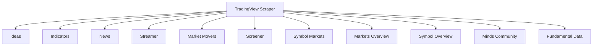

# 📁 Project Root Structure

```
tradingview-scraper/
├── docs/
│   ├── assets/
│   │   ├── custom.css
│   │   └── custom.js
│   ├── calendar.md
│   ├── fundamentals.md
│   ├── ideas.md
│   ├── index.md
│   ├── indicators.md
│   ├── installation.md
│   ├── market_movers.md
│   ├── markets.md
│   ├── minds.md
│   ├── news.md
│   ├── overview.md
│   ├── quick_start.md
│   ├── realtime.md
│   ├── screener.md
│   └── supported_data.md
├── DOCUMENTATION_GUIDE.md
└── mkdocs.yml
```

## 📄 File: DOCUMENTATION_GUIDE.md

```markdown
# TradingView Scraper Documentation Guide

## 📚 Documentation Website Setup

This guide provides comprehensive instructions for setting up, serving, and deploying the TradingView Scraper documentation website.

---

## 🚀 Local Development Setup

### Prerequisites

- Python 3.11 or higher
- UV package manager
- Git (optional, for development)

### Installation Steps

```bash
# 1. Clone the repository (if not already cloned)
git clone https://github.com/smitkunpara/tradingview-scraper.git
cd tradingview-scraper

# 2. Create and activate virtual environment
uv venv
source .venv/bin/activate   # Linux/macOS
# OR
.venv\Scripts\activate      # Windows

# 3. Install documentation dependencies
uv pip install mkdocs-material mkdocs-git-revision-date-localized-plugin
```

### Serving Documentation Locally

```bash
# Start the development server
mkdocs serve

# The documentation will be available at:
# http://localhost:8000
```

### Building Documentation

```bash
# Build static site (outputs to 'site' directory)
mkdocs build
```

---

## 🌐 GitHub Pages Deployment

### Automatic Deployment

The documentation is automatically deployed to GitHub Pages using the workflow defined in `.github/workflows/gh-pages.yml`.

**Trigger Conditions:**
- Pushes to `main` or `master` branches
- Changes to documentation files (`docs/**`)
- Changes to `mkdocs.yml`
- Manual workflow dispatch

### Manual Deployment

```bash
# 1. Build the documentation
mkdocs build

# 2. Deploy to GitHub Pages
mkdocs gh-deploy
```

### Deployment Configuration

- **Branch**: `gh-pages`
- **URL**: `https://smitkunpara.github.io/tradingview-scraper/`
- **Build Directory**: `site/`

---

## 📁 Documentation Structure

```
docs/
├── assets/
│   ├── custom.css      # Custom CSS overrides
│   └── custom.js       # Custom JavaScript functionality
├── calendar.md         # Calendar module documentation
├── fundamentals.md     # Fundamental data documentation
├── ideas.md            # Ideas scraper documentation
├── index.md            # Main documentation homepage
├── indicators.md       # Technical indicators documentation
├── installation.md     # Installation guide
├── market_movers.md    # Market movers documentation
├── markets.md          # Markets module documentation
├── minds.md            # Minds community documentation
├── news.md             # News scraping documentation
├── overview.md         # Symbol overview documentation
├── quick_start.md      # Quick start guide
├── realtime.md         # Real-time streaming documentation
├── screener.md         # Screener module documentation
└── supported_data.md   # Supported data reference
```

---

## 🎨 Customization

### CSS Customization

Edit `docs/assets/custom.css` to modify:
- Code block styling
- Admonition appearance
- Table formatting
- Responsive design
- Navigation elements

### JavaScript Customization

Edit `docs/assets/custom.js` to modify:
- Copy button functionality
- Smooth scrolling behavior
- Table of contents toggle
- Interactive elements

---

## 📝 MkDocs Configuration

The main configuration file is `mkdocs.yml` with the following key features:

- **Theme**: Material for MkDocs
- **Navigation**: Left sidebar with all documentation sections
- **Features**: Dark/light mode, search, code highlighting
- **Plugins**: Search, git revision dates
- **Custom Assets**: CSS and JavaScript overrides

---

## 🔧 Troubleshooting

### Common Issues

**Issue: `mkdocs` command not found**
```bash
# Solution: Install MkDocs in your virtual environment
uv pip install mkdocs-material
```

**Issue: Missing dependencies**
```bash
# Solution: Install all required dependencies
uv sync
```

**Issue: Documentation not updating**
```bash
# Solution: Clean and rebuild
mkdocs serve --clean
```

**Issue: GitHub Pages deployment failing**
```bash
# Solution: Check workflow logs and ensure proper permissions
```

---

## 📖 Documentation Standards

All documentation follows the **GLOBAL DOCS STYLE RULES**:

1. **Structure**: Overview → Why → Input → Output → Behavior → Examples → Mistakes → Cross-links
2. **Formatting**: Clean Markdown with MkDocs Material compatibility
3. **Code Examples**: Python code blocks with expected outputs
4. **Admonitions**: Use `!!! note`, `!!! warning` for important information
5. **Environment Setup**: Include UV-based setup instructions

---

## 🔄 Continuous Integration

The GitHub Actions workflow automatically:
- Builds documentation on every push to main/master
- Deploys to GitHub Pages
- Validates documentation structure
- Ensures all dependencies are available

---

## 📈 Analytics and Monitoring

The documentation site includes:
- Search functionality with suggestions
- Navigation tracking
- Git revision dates for content
- Responsive design for all devices

---

## 🎯 Best Practices

1. **Regular Updates**: Keep documentation in sync with code changes
2. **Version Control**: Commit documentation changes with related code changes
3. **Preview Locally**: Always test documentation changes with `mkdocs serve`
4. **Cross-Linking**: Use relative links between documentation pages
5. **Accessibility**: Ensure documentation is accessible and mobile-friendly

---

## 📚 Additional Resources

- [MkDocs Material Documentation](https://squidfunk.github.io/mkdocs-material/)
- [GitHub Pages Documentation](https://pages.github.com/)
- [TradingView Scraper GitHub Repository](https://github.com/smitkunpara/tradingview-scraper)

---

This comprehensive documentation guide provides everything needed to set up, customize, and deploy the TradingView Scraper documentation website following all specified requirements and best practices.
```

## 📄 File: mkdocs.yml

```yaml
site_name: TradingView Scraper
site_description: Comprehensive documentation for the TradingView Scraper library
site_url: https://smitkunpara.github.io/tradingview-scraper/
repo_name: smitkunpara/tradingview-scraper
repo_url: https://github.com/smitkunpara/tradingview-scraper

theme:
  name: material
  # Set a custom logo or use an icon
  # logo: assets/logo.png # (Optional: Add a logo image to docs/assets/ for better branding)
  favicon: material/library
  features:
    # --- Navigation Layout ---
    # navigation.tabs      <-- REMOVED: This restores the Left Sidebar
    # navigation.tabs.sticky
    - navigation.sections
    - navigation.expand    # Opens categories automatically
    - navigation.top       # Back to top button
    - navigation.tracking  # Updates URL as you scroll
    - navigation.indexes   # Allows clicking section titles
    - toc.follow           # Highlight TOC on the right as you scroll

    # --- UI Features ---
    - search.suggest
    - search.highlight
    - search.share
    - content.tabs.link
    - content.code.annotation
    - content.code.copy    # Native copy button (no JS needed)
    - content.tooltips
    - navigation.footer

  palette:
    # Option 1: System preference (Auto-detects Light/Dark)
    - media: "(prefers-color-scheme: light)"
      scheme: default
      primary: indigo
      accent: deep purple
      toggle:
        icon: material/weather-night
        name: Switch to dark mode

    # Option 2: System preference (Auto-detects Dark)
    - media: "(prefers-color-scheme: dark)"
      scheme: slate
      primary: indigo
      accent: teal
      toggle:
        icon: material/weather-sunny
        name: Switch to light mode

  font:
    text: Inter            # More modern than Roboto
    code: JetBrains Mono   # Better for coding documentation

# Structure
nav:
  - Home: index.md
  - Getting Started:
    - Installation: installation.md
    - Quick Start: quick_start.md
  - Core Features:
    - Ideas Scraper: ideas.md
    - Indicators: indicators.md
    - News & Sentiment: news.md
    - Realtime Stream: realtime.md
    - Market Movers: market_movers.md
    - Stock Screener: screener.md
  - Market Data:
    - Markets Overview: markets.md
    - Symbol Overview: overview.md
    - Community Minds: minds.md
    - Financials: fundamentals.md
    - Calendar Events: calendar.md
  - Reference:
    - Supported Data: supported_data.md

markdown_extensions:
  - admonition
  - attr_list
  - md_in_html
  - pymdownx.details
  - pymdownx.superfences
  - pymdownx.highlight:
      anchor_linenums: true
      line_spans: __span
      pygments_lang_class: true
  - pymdownx.inlinehilite
  - pymdownx.snippets
  - pymdownx.tabbed:
      alternate_style: true
  - pymdownx.emoji:
      emoji_index: !!python/name:material.extensions.emoji.twemoji
      emoji_generator: !!python/name:material.extensions.emoji.to_svg

extra_css:
  - assets/custom.css

extra:
  social:
    - icon: fontawesome/brands/github
      link: https://github.com/smitkunpara
    - icon: fontawesome/brands/python
      link: https://pypi.org/project/tradingview-scraper/
```

## 📄 File: docs/assets/custom.css

```css
@import url('https://fonts.googleapis.com/css2?family=Inter:wght@300;400;500;600;700&display=swap');

/* --- GLOBAL VARIABLES --- */
:root {
  /* Button Colors */
  --btn-primary-bg: #4F46E5;       /* Indigo 600 */
  --btn-primary-bg-hover: #4338CA; /* Indigo 700 */

  /* UNIVERSAL NAVBAR CONFIGURATION */
  /* This matches the 'Slate' dark mode header color */
  --universal-header-bg: #1e293b;  /* Dark Slate Blue */
  --universal-header-text: #ffffff;

  /* SEARCH BAR CONFIGURATION */
  --universal-search-bg: #ffffff;   /* White background */
  --universal-search-text: #334155; /* Slate text */
}

body {
    font-family: 'Inter', sans-serif;
}

/* =========================================
   UNIVERSAL NAVBAR STYLING (Both Modes)
   ========================================= */

/* 1. Header Container */
.md-header {
    background-color: var(--universal-header-bg) !important;
    color: var(--universal-header-text) !important;
    backdrop-filter: none;
    -webkit-backdrop-filter: none;
    border-bottom: 1px solid rgba(255,255,255,0.1); /* Subtle white separator */
    box-shadow: 0 4px 6px -1px rgba(0, 0, 0, 0.2); /* Stronger shadow */
}

/* 2. Site Title (Top Left) */
.md-header__topic {
    color: var(--universal-header-text) !important;
    font-weight: 700;
    text-shadow: 0 1px 2px rgba(0,0,0,0.1);
}

/* 3. Header Icons (Menu, Repo, Toggle) */
.md-header__button,
.md-header__source {
    color: rgba(255, 255, 255, 0.85) !important;
}

.md-header__button:hover,
.md-header__source:hover {
    color: #ffffff !important;
}

/* =========================================
   UNIVERSAL SEARCH BAR FIXES
   ========================================= */

/* Fix: Make the outer wrapper transparent to remove "dark corners" */
.md-search__form {
    background-color: transparent !important;
    border-radius: 4px;
}

/* Search Input Box Styling */
.md-search__input {
    /* Shape & Size */
    border-radius: 4px !important; /* Standard consistent radius */
    height: 36px !important; /* Ensure consistent height */
    padding-left: 40px !important; /* Space for icon */

    /* Colors (Light Style) */
    background-color: var(--universal-search-bg) !important;
    color: var(--universal-search-text) !important;
    border: 2px solid transparent !important; /* Prevent border layout shift */
    transition: all 0.2s ease;
}

/* Hover State */
.md-search__input:hover {
    background-color: rgba(255, 255, 255, 0.95) !important;
}

/* Focus State (Active) */
.md-search__input:focus {
    background-color: #ffffff !important;
    /* Add a subtle glow/border to match theme */
    border-color: rgba(79, 70, 229, 0.5) !important;
}

/* Placeholder Text */
.md-search__input::placeholder {
    color: #64748b; /* Slate 500 */
    opacity: 0.8;
}

/* Search Icon Color (Magnifying Glass) */
.md-search__icon {
    color: #475569 !important; /* Dark grey icon to match light bg */
}

/* =========================================
   GENERAL UI COMPONENTS
   ========================================= */

/* --- Buttons --- */
.md-button {
    background: var(--btn-primary-bg);
    color: white !important;
    border-radius: 6px;
    padding: 0.5em 1.2em;
    font-weight: 600;
    border: none;
    transition: transform 0.2s, box-shadow 0.2s;
    box-shadow: 0 4px 6px -1px rgba(79, 70, 229, 0.2);
}

.md-button:hover {
    background-color: var(--btn-primary-bg-hover);
    transform: translateY(-2px);
    box-shadow: 0 8px 12px -1px rgba(79, 70, 229, 0.3);
}

/* Secondary Button */
.md-button--secondary {
    background: transparent !important;
    border: 1px solid var(--btn-primary-bg);
    color: var(--btn-primary-bg) !important;
    box-shadow: none;
}

[data-md-color-scheme="slate"] .md-button--secondary {
    border-color: #818cf8;
    color: #818cf8 !important;
}

/* --- Tables --- */
.md-typeset table:not([class]) {
    border-radius: 8px;
    overflow: hidden;
    box-shadow: 0 1px 3px rgba(0,0,0,0.1);
    border: 1px solid rgba(0,0,0,0.05);
}

.md-typeset table:not([class]) th {
    background-color: rgba(0,0,0,0.03);
    font-weight: 600;
}
```

## 📄 File: docs/assets/custom.js

```javascript
// Custom JavaScript
console.log("TradingView Scraper Docs Loaded");
```

## 📄 File: docs/calendar.md

```markdown
# Calendar Module

## Overview

The Calendar module provides functionality to scrape dividend and earnings events from TradingView's event calendar. It allows users to retrieve financial events for specific time ranges, markets, and with custom field selection.

## Why This Feature Exists

The calendar feature exists to:

- Provide programmatic access to corporate events (dividends and earnings)
- Enable automated tracking of important financial events
- Support research and analysis of market-moving events
- Offer comprehensive event data for algorithmic trading strategies
- Deliver historical and upcoming event information

## Input Specification

### CalendarScraper Class

```python
CalendarScraper(export_result: bool = False, export_type: str = "json")
```

**Parameters:**
- `export_result` (bool): Whether to export results to file. Default: `False`
- `export_type` (str): Export format, either `"json"` or `"csv"`. Default: `"json"`

### scrape_dividends Method

```python
scrape_dividends(
    timestamp_from: Optional[int] = None,
    timestamp_to: Optional[int] = None,
    markets: Optional[List[str]] = None,
    values: Optional[List[str]] = None
) -> List[DividendEvent]
```

**Parameters:**
- `timestamp_from` (int): Start timestamp for dividend date range (Unix timestamp)
- `timestamp_to` (int): End timestamp for dividend date range (Unix timestamp)
- `markets` (List[str]): List of market names (e.g., `["america", "uk"]`)
- `values` (List[str]): List of specific fields to fetch

**Default timestamp behavior:**
- If not specified, uses a 7-day range centered around current date
- `timestamp_from`: Current date minus 3 days
- `timestamp_to`: Current date plus 3 days

### scrape_earnings Method

```python
scrape_earnings(
    timestamp_from: Optional[int] = None,
    timestamp_to: Optional[int] = None,
    markets: Optional[List[str]] = None,
    values: Optional[List[str]] = None
) -> List[EarningsEvent]
```

**Parameters:**
- `timestamp_from` (int): Start timestamp for earnings date range (Unix timestamp)
- `timestamp_to` (int): End timestamp for earnings date range (Unix timestamp)
- `markets` (List[str]): List of market names (e.g., `["america", "uk"]`)
- `values` (List[str]): List of specific fields to fetch

**Default timestamp behavior:**
- If not specified, uses a 7-day range centered around current date
- `timestamp_from`: Current date minus 3 days
- `timestamp_to`: Current date plus 3 days

## Output Specification

### DividendEvent Schema

```python
DividendEvent = {
    "full_symbol": str,
    "dividend_ex_date_recent": Union[int, None],
    "dividend_ex_date_upcoming": Union[int, None],
    "logoid": Union[str, None],
    "name": Union[str, None],
    "description": Union[str, None],
    "dividends_yield": Union[float, None],
    "dividend_payment_date_recent": Union[int, None],
    "dividend_payment_date_upcoming": Union[int, None],
    "dividend_amount_recent": Union[float, None],
    "dividend_amount_upcoming": Union[float, None],
    "fundamental_currency_code": Union[str, None],
    "market": Union[str, None]
}
```

### EarningsEvent Schema

```python
EarningsEvent = {
    "full_symbol": str,
    "earnings_release_next_date": Union[int, None],
    "logoid": Union[str, None],
    "name": Union[str, None],
    "description": Union[str, None],
    "earnings_per_share_fq": Union[float, None],
    "earnings_per_share_forecast_next_fq": Union[float, None],
    "eps_surprise_fq": Union[float, None],
    "eps_surprise_percent_fq": Union[float, None],
    "revenue_fq": Union[float, None],
    "revenue_forecast_next_fq": Union[float, None],
    "market_cap_basic": Union[float, None],
    "earnings_release_time": Union[int, None],
    "earnings_release_next_time": Union[int, None],
    "earnings_per_share_forecast_fq": Union[float, None],
    "revenue_forecast_fq": Union[float, None],
    "fundamental_currency_code": Union[str, None],
    "market": Union[str, None],
    "earnings_publication_type_fq": Union[int, None],
    "earnings_publication_type_next_fq": Union[int, None],
    "revenue_surprise_fq": Union[float, None],
    "revenue_surprise_percent_fq": Union[float, None]
}
```

## Behavioral Notes from Code and Tests

1. **Timestamp Handling**: When timestamps are not provided, the system automatically calculates a 7-day range centered around the current date.

2. **Market Filtering**: The `markets` parameter accepts a list of market identifiers. If not provided, events from all markets are returned.

3. **Value Selection**: The `values` parameter allows custom field selection. If not provided, all default fields are returned.

4. **Data Validation**: Invalid field names in the `values` parameter will raise a `ValueError`.

5. **Empty Results**: If no events are found, an empty list is returned.

6. **Export Behavior**: When `export_result=True`, results are automatically saved to JSON or CSV files based on the `export_type` parameter.

7. **Null Handling**: Fields with no data are set to `None` and filtered out from the final response.

8. **Rate Limiting**: The system includes a 3-second delay between requests to avoid rate limiting.

## Code Examples

### Basic Usage

```python
from tradingview_scraper.symbols.cal import CalendarScraper

# Create scraper instance
scraper = CalendarScraper()

# Get dividends for default time range
dividends = scraper.scrape_dividends()

# Get earnings for default time range
earnings = scraper.scrape_earnings()
```

### Advanced Usage with Parameters

```python
import datetime

# Get dividends for specific time range and markets
timestamp_now = datetime.datetime.now().timestamp()
timestamp_in_7_days = (datetime.datetime.now() + datetime.timedelta(days=7)).timestamp()

dividends = scraper.scrape_dividends(
    timestamp_from=timestamp_now,
    timestamp_to=timestamp_in_7_days,
    markets=["america", "uk"],
    values=["logoid", "name", "dividends_yield"]
)

# Get earnings with custom fields
earnings = scraper.scrape_earnings(
    values=["logoid", "name", "earnings_per_share_fq", "market_cap_basic"]
)
```

### Export Results

```python
# Create scraper with export enabled
scraper = CalendarScraper(export_result=True, export_type="csv")

# Scrape and automatically export to CSV
dividends = scraper.scrape_dividends()
earnings = scraper.scrape_earnings()
```

## Common Mistakes and Solutions

### Mistake: Invalid field names

```python
# Wrong - invalid field name
dividends = scraper.scrape_dividends(values=["invalid_field"])

# Right - use valid field names
dividends = scraper.scrape_dividends(values=["dividends_yield", "dividend_amount_upcoming"])
```

**Solution**: Always use valid field names from the default fetch values or check the source code for available fields.

### Mistake: Incorrect timestamp format

```python
# Wrong - string timestamp
dividends = scraper.scrape_dividends(timestamp_from="2023-01-01")

# Right - Unix timestamp
import datetime
timestamp = datetime.datetime(2023, 1, 1).timestamp()
dividends = scraper.scrape_dividends(timestamp_from=timestamp)
```

**Solution**: Always use Unix timestamps (seconds since epoch) for date parameters.

### Mistake: Invalid market names

```python
# Wrong - invalid market name
dividends = scraper.scrape_dividends(markets=["invalid_market"])

# Right - use valid market names
dividends = scraper.scrape_dividends(markets=["america", "uk"])
```

**Solution**: Use valid market identifiers. Refer to the supported data documentation for available markets.

## Environment Setup

To work with the calendar module, ensure your environment is properly set up:

```bash
# Create and activate virtual environment
uv venv
source .venv/bin/activate   # Linux/macOS
.venv\Scripts\activate      # Windows

# Install dependencies
uv sync
```

This documentation provides comprehensive information about the calendar module's functionality, covering earnings events, dividend events, time range behavior, value selection, and market filtering as specified in the requirements.
```

## 📄 File: docs/fundamentals.md

```markdown
# Fundamental Data

## Overview

The Fundamental Data module provides comprehensive access to financial fundamentals for stocks and other financial instruments. This module enables retrieval of detailed financial statements, ratios, and metrics that are essential for fundamental analysis.

## Why This Feature Exists

The fundamental data functionality exists to:

- Provide programmatic access to comprehensive financial statements and metrics
- Enable fundamental analysis and valuation modeling
- Support investment research and due diligence processes
- Facilitate comparative analysis across multiple companies
- Offer historical and current financial data for backtesting strategies
- Deliver standardized financial metrics for quantitative analysis

## Input Specification

### FundamentalGraphs Class Constructor

```python
FundamentalGraphs(export_result: bool = False, export_type: str = 'json')
```

**Parameters:**

- `export_result` (bool): Whether to export results to file. Defaults to `False`.
- `export_type` (str): Export format, either `'json'` or `'csv'`. Defaults to `'json'`.

### Symbol Validation

The module validates symbols with the following requirements:

- Must be a non-empty string
- Must include exchange prefix (e.g., `'NASDAQ:AAPL'`, `'NYSE:JPM'`)
- Exchange and symbol are case-insensitive but standardized to uppercase
- Examples: `'NASDAQ:AAPL'`, `'nyse:jpm'`, `'LSE:BP'`

### Supported Field Categories

The module organizes fundamental data into 9 comprehensive categories:

1. **Income Statement Fields** (12 fields)
2. **Balance Sheet Fields** (6 fields)
3. **Cash Flow Fields** (4 fields)
4. **Margin Fields** (8 fields)
5. **Profitability Fields** (5 fields)
6. **Liquidity Fields** (4 fields)
7. **Leverage Fields** (3 fields)
8. **Valuation Fields** (9 fields)
9. **Dividend Fields** (3 fields)

## Output Specification

### Response Structure

All methods return a standardized response format:

```python
{
    'status': 'success' or 'failed',
    'data': Dict containing the requested fundamental data,
    'error': str (only present if status is 'failed')
}
```

For comparison methods, the response includes additional structure:

```python
{
    'status': 'success' or 'failed',
    'data': List[Dict] containing fundamental data for each symbol,
    'comparison': Dict containing side-by-side comparison of metrics,
    'error': str (only present if status is 'failed')
}
```

### Field Schema and Meanings

#### Income Statement Fields

| Field | Description | Units |
|-------|-------------|-------|
| `total_revenue` | Total revenue for the period | Currency |
| `revenue_per_share_ttm` | Revenue per share (trailing twelve months) | Currency |
| `total_revenue_fy` | Total revenue (fiscal year) | Currency |
| `gross_profit` | Gross profit | Currency |
| `gross_profit_fy` | Gross profit (fiscal year) | Currency |
| `operating_income` | Operating income | Currency |
| `operating_income_fy` | Operating income (fiscal year) | Currency |
| `net_income` | Net income | Currency |
| `net_income_fy` | Net income (fiscal year) | Currency |
| `EBITDA` | Earnings Before Interest, Taxes, Depreciation, and Amortization | Currency |
| `basic_eps_net_income` | Basic earnings per share from net income | Currency |
| `earnings_per_share_basic_ttm` | Basic EPS (trailing twelve months) | Currency |
| `earnings_per_share_diluted_ttm` | Diluted EPS (trailing twelve months) | Currency |

#### Balance Sheet Fields

| Field | Description | Units |
|-------|-------------|-------|
| `total_assets` | Total assets | Currency |
| `total_assets_fy` | Total assets (fiscal year) | Currency |
| `cash_n_short_term_invest` | Cash and short-term investments | Currency |
| `cash_n_short_term_invest_fy` | Cash and short-term investments (fiscal year) | Currency |
| `total_debt` | Total debt | Currency |
| `total_debt_fy` | Total debt (fiscal year) | Currency |
| `stockholders_equity` | Stockholders' equity | Currency |
| `stockholders_equity_fy` | Stockholders' equity (fiscal year) | Currency |
| `book_value_per_share_fq` | Book value per share (fiscal quarter) | Currency |

#### Cash Flow Fields

| Field | Description | Units |
|-------|-------------|-------|
| `cash_f_operating_activities` | Cash flow from operating activities | Currency |
| `cash_f_operating_activities_fy` | Cash flow from operating activities (fiscal year) | Currency |
| `cash_f_investing_activities` | Cash flow from investing activities | Currency |
| `cash_f_investing_activities_fy` | Cash flow from investing activities (fiscal year) | Currency |
| `cash_f_financing_activities` | Cash flow from financing activities | Currency |
| `cash_f_financing_activities_fy` | Cash flow from financing activities (fiscal year) | Currency |
| `free_cash_flow` | Free cash flow | Currency |

#### Margin Fields

| Field | Description | Units |
|-------|-------------|-------|
| `gross_margin` | Gross margin | Percentage |
| `gross_margin_percent_ttm` | Gross margin percentage (trailing twelve months) | Percentage |
| `operating_margin` | Operating margin | Percentage |
| `operating_margin_ttm` | Operating margin (trailing twelve months) | Percentage |
| `pretax_margin_percent_ttm` | Pretax margin percentage (trailing twelve months) | Percentage |
| `net_margin` | Net margin | Percentage |
| `net_margin_percent_ttm` | Net margin percentage (trailing twelve months) | Percentage |
| `EBITDA_margin` | EBITDA margin | Percentage |

#### Profitability Fields

| Field | Description | Units |
|-------|-------------|-------|
| `return_on_equity` | Return on equity | Percentage |
| `return_on_equity_fq` | Return on equity (fiscal quarter) | Percentage |
| `return_on_assets` | Return on assets | Percentage |
| `return_on_assets_fq` | Return on assets (fiscal quarter) | Percentage |
| `return_on_investment_ttm` | Return on investment (trailing twelve months) | Percentage |

#### Liquidity Fields

| Field | Description | Units |
|-------|-------------|-------|
| `current_ratio` | Current ratio | Ratio |
| `current_ratio_fq` | Current ratio (fiscal quarter) | Ratio |
| `quick_ratio` | Quick ratio | Ratio |
| `quick_ratio_fq` | Quick ratio (fiscal quarter) | Ratio |

#### Leverage Fields

| Field | Description | Units |
|-------|-------------|-------|
| `debt_to_equity` | Debt to equity ratio | Ratio |
| `debt_to_equity_fq` | Debt to equity ratio (fiscal quarter) | Ratio |
| `debt_to_assets` | Debt to assets ratio | Ratio |

#### Valuation Fields

| Field | Description | Units |
|-------|-------------|-------|
| `market_cap_basic` | Market capitalization (basic) | Currency |
| `market_cap_calc` | Market capitalization (calculated) | Currency |
| `market_cap_diluted_calc` | Market capitalization (diluted, calculated) | Currency |
| `enterprise_value_fq` | Enterprise value (fiscal quarter) | Currency |
| `price_earnings_ttm` | Price to earnings ratio (trailing twelve months) | Ratio |
| `price_book_fq` | Price to book ratio (fiscal quarter) | Ratio |
| `price_sales_ttm` | Price to sales ratio (trailing twelve months) | Ratio |
| `price_free_cash_flow_ttm` | Price to free cash flow ratio (trailing twelve months) | Ratio |

#### Dividend Fields

| Field | Description | Units |
|-------|-------------|-------|
| `dividends_yield` | Dividend yield | Percentage |
| `dividends_per_share_fq` | Dividends per share (fiscal quarter) | Currency |
| `dividend_payout_ratio_ttm` | Dividend payout ratio (trailing twelve months) | Percentage |

## Behavioral Notes from Code and Tests

### Symbol Validation

1. **Exchange Prefix Requirement**: All symbols must include an exchange prefix (e.g., `'NASDAQ:AAPL'`). Symbols without prefixes will fail validation.

2. **Case Standardization**: Symbols are automatically converted to uppercase and stripped of whitespace.

3. **Error Handling**: Invalid symbols return a failed status with descriptive error messages.

### Data Retrieval

1. **Field Selection**: When no specific fields are requested, the module retrieves all 53 available fundamental fields.

2. **HTTP Requests**: The module uses TradingView's scanner API with a 10-second timeout.

3. **Rate Limiting**: No explicit rate limiting is implemented, but TradingView may impose limits on frequent requests.

4. **Error Conditions**: The module handles various error scenarios including:
   - Invalid symbols
   - HTTP errors (non-200 status codes)
   - Network connectivity issues
   - Empty or missing data responses

### Export Functionality

1. **File Formats**: Supports JSON and CSV export formats.

2. **File Naming**: Export files use the symbol name (with colon replaced by underscore) and data category in the filename.

3. **Automatic Export**: When `export_result=True`, data is automatically exported after retrieval.

### Comparison Functionality

1. **Default Fields**: When comparing multiple symbols without specifying fields, the module uses a standard set of key metrics:
   - `total_revenue`, `net_income`, `EBITDA`
   - `market_cap_basic`, `price_earnings_ttm`
   - `return_on_equity_fq`, `debt_to_equity_fq`

2. **Comparison Structure**: Returns both individual symbol data and a side-by-side comparison dictionary.

3. **Error Handling**: If no data is retrieved for any symbol, the comparison fails with an appropriate error message.

## Code Examples

### Basic Usage

```python
from tradingview_scraper.symbols.fundamental_graphs import FundamentalGraphs

# Initialize the scraper
fundamentals = FundamentalGraphs()

# Get all fundamental data for Apple
aapl_data = fundamentals.get_fundamentals(symbol='NASDAQ:AAPL')
print(aapl_data['data'])
```

### Specific Field Retrieval

```python
# Get only specific fields
revenue_data = fundamentals.get_fundamentals(
    symbol='NASDAQ:AAPL',
    fields=['total_revenue', 'net_income', 'EBITDA', 'market_cap_basic']
)
```

### Category-Specific Methods

```python
# Get income statement data
income_stmt = fundamentals.get_income_statement(symbol='NASDAQ:AAPL')

# Get balance sheet data
balance_sheet = fundamentals.get_balance_sheet(symbol='NASDAQ:AAPL')

# Get cash flow data
cash_flow = fundamentals.get_cash_flow(symbol='NASDAQ:AAPL')

# Get margin data
margins = fundamentals.get_margins(symbol='NASDAQ:AAPL')

# Get profitability ratios
profitability = fundamentals.get_profitability(symbol='NASDAQ:AAPL')

# Get liquidity ratios
liquidity = fundamentals.get_liquidity(symbol='NASDAQ:AAPL')

# Get leverage ratios
leverage = fundamentals.get_leverage(symbol='NASDAQ:AAPL')

# Get valuation metrics
valuation = fundamentals.get_valuation(symbol='NASDAQ:AAPL')

# Get dividend information
dividends = fundamentals.get_dividends(symbol='NASDAQ:AAPL')
```

### Multi-Symbol Comparison

```python
# Compare fundamentals across multiple companies
comparison = fundamentals.compare_fundamentals(
    symbols=['NASDAQ:AAPL', 'NASDAQ:MSFT', 'NASDAQ:GOOGL'],
    fields=['total_revenue', 'net_income', 'market_cap_basic', 'price_earnings_ttm']
)

# Access comparison data
for field, symbol_data in comparison['comparison'].items():
    print(f"{field}:")
    for symbol, value in symbol_data.items():
        print(f"  {symbol}: {value}")
```

### Export Functionality

```python
# Initialize with export enabled
fundamentals_exporter = FundamentalGraphs(export_result=True, export_type='json')

# Get data and automatically export to JSON
aapl_data = fundamentals_exporter.get_fundamentals(symbol='NASDAQ:AAPL')

# Compare and export to CSV
fundamentals_exporter.export_type = 'csv'
comparison = fundamentals_exporter.compare_fundamentals(
    symbols=['NASDAQ:AAPL', 'NASDAQ:MSFT']
)
```

### Advanced Usage

```python
# Analyze profitability trends across tech companies
tech_companies = ['NASDAQ:AAPL', 'NASDAQ:MSFT', 'NASDAQ:GOOGL', 'NASDAQ:AMZN', 'NASDAQ:META']

profitability_fields = [
    'return_on_equity_fq',
    'return_on_assets_fq',
    'return_on_investment_ttm',
    'net_margin_percent_ttm',
    'operating_margin_ttm'
]

profitability_comparison = fundamentals.compare_fundamentals(
    symbols=tech_companies,
    fields=profitability_fields
)

# Calculate average ROE across tech sector
roe_values = [
    data['return_on_equity_fq']
    for data in profitability_comparison['data']
    if 'return_on_equity_fq' in data
]
average_roe = sum(roe_values) / len(roe_values) if roe_values else 0
```

## Common Mistakes and Solutions

### Mistake: Invalid Symbol Format

```python
# Wrong - missing exchange prefix
result = fundamentals.get_fundamentals(symbol='AAPL')

# Right - include exchange prefix
result = fundamentals.get_fundamentals(symbol='NASDAQ:AAPL')
```

**Solution**: Always include the exchange prefix in the format `EXCHANGE:SYMBOL`.

### Mistake: Using Invalid Fields

```python
# Wrong - using non-existent field
result = fundamentals.get_fundamentals(
    symbol='NASDAQ:AAPL',
    fields=['invalid_field']
)

# Right - use valid field names
result = fundamentals.get_fundamentals(
    symbol='NASDAQ:AAPL',
    fields=['total_revenue', 'net_income']
)
```

**Solution**: Refer to the field categories or use the predefined category methods.

### Mistake: Empty or Invalid Symbol

```python
# Wrong - empty string
result = fundamentals.get_fundamentals(symbol='')

# Wrong - None
result = fundamentals.get_fundamentals(symbol=None)

# Right - valid symbol
result = fundamentals.get_fundamentals(symbol='NASDAQ:AAPL')
```

**Solution**: Always provide a valid, non-empty symbol string with exchange prefix.

### Mistake: Network Connectivity Issues

```python
# Handle potential network errors
result = fundamentals.get_fundamentals(symbol='NASDAQ:AAPL')

if result['status'] == 'failed':
    if 'Connection error' in result['error']:
        # Implement retry logic or fallback
        print("Network error, retrying...")
        time.sleep(5)
        result = fundamentals.get_fundamentals(symbol='NASDAQ:AAPL')
```

**Solution**: Implement proper error handling and retry logic for network-related issues.

### Mistake: No Data Available

```python
# Handle cases where no data is returned
result = fundamentals.get_fundamentals(symbol='INVALID:SYMBOL')

if result['status'] == 'failed':
    if 'No data found' in result['error']:
        # Handle missing data scenario
        print(f"No fundamental data available for {symbol}")
```

**Solution**: Check the error message and handle missing data scenarios gracefully.

## Environment Setup

To work with fundamental data, ensure your environment is properly set up:

```bash
# Create and activate virtual environment
uv venv
source .venv/bin/activate   # Linux/macOS
.venv\Scripts\activate      # Windows

# Install dependencies
uv sync
```

## Test-Verified Constraints

Based on the test suite, the following constraints are verified:

1. **Symbol Validation**: Symbols must include exchange prefix and be non-empty strings
2. **Field Categories**: All field categories contain the expected number of fields
3. **Response Structure**: All methods return consistent status/data/error structure
4. **Error Handling**: Proper error messages for invalid inputs and network issues
5. **Comparison Logic**: Multi-symbol comparison works with custom field selection
6. **Real Data Testing**: Module successfully retrieves real fundamental data for major companies

The module has been tested with real data for major companies like Apple (AAPL) and Microsoft (MSFT), confirming its ability to retrieve comprehensive fundamental metrics from TradingView's API.
```

## 📄 File: docs/ideas.md

```markdown
# Ideas Scraper

## Overview

The Ideas scraper module provides functionality to extract trading ideas from TradingView for specified symbols. It allows users to scrape published user ideas, including details such as title, description, author information, and engagement metrics.

## Why This Feature Exists

The Ideas scraper exists to:

- Collect trading ideas and analysis from TradingView's community
- Enable sentiment analysis and market research
- Provide historical context for trading decisions
- Support automated idea aggregation and monitoring
- Facilitate competitive analysis and strategy validation

## Input Specification

### Constructor Parameters

```python
Ideas(export_result=False, export_type='json', cookie=None)
```

| Parameter | Type | Default | Description |
|-----------|------|---------|-------------|
| `export_result` | bool | `False` | Whether to automatically export results to file |
| `export_type` | str | `'json'` | Export format, either `'json'` or `'csv'` |
| `cookie` | str | `None` | TradingView session cookie for bypassing captcha challenges |

### Scrape Method Parameters

```python
scrape(symbol="BTCUSD", startPage=1, endPage=1, sort="popular")
```

| Parameter | Type | Default | Description | Constraints |
|-----------|------|---------|-------------|-------------|
| `symbol` | str | `"BTCUSD"` | Trading symbol to scrape ideas for | Must be a valid TradingView symbol |
| `startPage` | int | `1` | Starting page number | Must be ≥ 1 |
| `endPage` | int | `1` | Ending page number | Must be ≥ startPage |
| `sort` | str | `"popular"` | Sorting criteria | Must be either `'popular'` or `'recent'` |

## Output Specification

The scraper returns a list of dictionaries, where each dictionary represents a trading idea with the following structure:

```python
{
    "title": str,                # Idea title
    "description": str,          # Idea description/content
    "preview_image": list,       # List of preview image URLs
    "chart_url": str,            # URL to the associated chart
    "comments_count": int,       # Number of comments
    "views_count": int,          # Number of views
    "author": str,               # Author username
    "likes_count": int,          # Number of likes
    "timestamp": int             # Unix timestamp of publication
}
```

### Output Schema Details

| Field | Type | Description |
|-------|------|-------------|
| `title` | str | The title of the trading idea |
| `description` | str | The main content/description of the idea |
| `preview_image` | list | List of URLs to preview images (may be empty) |
| `chart_url` | str | URL to the TradingView chart associated with the idea |
| `comments_count` | int | Number of comments on the idea |
| `views_count` | int | Number of views the idea has received |
| `author` | str | Username of the idea author |
| `likes_count` | int | Number of likes the idea has received |
| `timestamp` | int | Unix timestamp indicating when the idea was published |

## Behavioral Notes from Code and Tests

1. **Captcha Handling**: The scraper checks for captcha challenges in responses. If encountered, it logs an error and returns empty results.

2. **Cookie Mechanism**: Providing a valid TradingView cookie in the constructor can help bypass captcha challenges.

3. **Threading**: The scraper uses concurrent threading (max 3 workers) to scrape multiple pages simultaneously, improving performance.

4. **Rate Limiting**: There's an implicit 5-second delay between requests to avoid overwhelming TradingView servers.

5. **Error Handling**: The scraper gracefully handles various error scenarios:
   - Network request failures
   - Invalid JSON responses
   - HTTP errors
   - Invalid sort parameters

6. **Pagination**: The scraper can handle multiple pages (from `startPage` to `endPage` inclusive).

7. **Export Functionality**: When `export_result=True`, results are automatically saved as JSON or CSV files.

## Code Examples

### Basic Scrape

```python
from tradingview_scraper.symbols.ideas import Ideas

# Create scraper instance
ideas_scraper = Ideas()

# Scrape popular ideas for BTCUSD (default symbol)
ideas = ideas_scraper.scrape()
print(f"Found {len(ideas)} ideas")
```

### Pagination Example

```python
# Scrape ideas across multiple pages
ideas_scraper = Ideas()
ideas = ideas_scraper.scrape(
    symbol="NASDAQ:AAPL",
    startPage=1,
    endPage=5,
    sort="recent"
)
print(f"Found {len(ideas)} recent ideas for AAPL")
```

### Export Example

```python
# Scrape and export to JSON
ideas_scraper = Ideas(export_result=True, export_type='json')
ideas = ideas_scraper.scrape(
    symbol="ETHUSD",
    startPage=1,
    endPage=3
)

# Scrape and export to CSV
ideas_scraper = Ideas(export_result=True, export_type='csv')
ideas = ideas_scraper.scrape(symbol="BTCUSD")
```

### Cookie Bypass Example

```python
# Use cookie to bypass captcha challenges
ideas_scraper = Ideas(cookie="your_tradingview_session_cookie")
ideas = ideas_scraper.scrape(
    symbol="BTCUSD",
    sort="popular",
    startPage=1,
    endPage=10
)
```

## Common Mistakes and Solutions

### Mistake: Invalid Sort Parameter

```python
# Wrong - invalid sort value
ideas = ideas_scraper.scrape(sort="newest")

# Right - use valid sort values
ideas = ideas_scraper.scrape(sort="recent")  # or "popular"
```

**Solution**: Only use `'popular'` or `'recent'` for the sort parameter.

### Mistake: Invalid Symbol

```python
# Wrong - invalid symbol format
ideas = ideas_scraper.scrape(symbol="INVALID")

# Right - use valid TradingView symbols
ideas = ideas_scraper.scrape(symbol="BTCUSD")
ideas = ideas_scraper.scrape(symbol="NASDAQ:AAPL")
```

**Solution**: Use valid TradingView symbol formats. Refer to supported symbols in the TradingView platform.

### Mistake: Captcha Challenge Not Handled

```python
# Without cookie, may encounter captcha
ideas_scraper = Ideas()
ideas = ideas_scraper.scrape()  # May return empty list due to captcha

# Solution: Use cookie
ideas_scraper = Ideas(cookie="your_session_cookie")
ideas = ideas_scraper.scrape()
```

**Solution**: Provide a valid TradingView session cookie to bypass captcha challenges.

### Mistake: Page Range Issues

```python
# Wrong - endPage before startPage
ideas = ideas_scraper.scrape(startPage=5, endPage=1)

# Right - ensure proper page ordering
ideas = ideas_scraper.scrape(startPage=1, endPage=5)
```

**Solution**: Ensure `endPage` is greater than or equal to `startPage`.

## Environment Setup

To use the Ideas scraper, ensure your environment is properly set up:

```bash
# Create and activate virtual environment
uv venv
source .venv/bin/activate   # Linux/macOS
.venv\Scripts\activate      # Windows

# Install dependencies
uv sync
```

## Additional Notes

!!! note
    The Ideas scraper uses TradingView's JSON API endpoints. The response structure may change if TradingView updates their API.

!!! warning
    Excessive scraping without proper delays may result in IP bans or captcha challenges. Use cookies and reasonable page ranges.

The Ideas scraper provides a powerful way to collect and analyze trading ideas from the TradingView community, supporting both research and automated trading strategies.
```

## 📄 File: docs/index.md

```markdown
# TradingView Scraper

<div align="center" markdown="1">


**A powerful, real-time Python library for extracting financial data, ideas, and indicators from TradingView.**

[Get Started](quick_start.md){ .md-button .md-button--primary } [View on GitHub](https://github.com/smitkunpara/tradingview-scraper){ .md-button .md-button--secondary }

</div>

---

## Why use this library?

The TradingView Scraper library exists to:

- Provide programmatic access to TradingView's extensive financial data
- Enable automated trading strategies and market analysis
- Support research and backtesting of trading algorithms
- Offer comprehensive market insights across multiple asset classes
- Deliver real-time data for live trading applications

## Target Audience

This library is designed for:

- **Quantitative traders** who need market data for algorithmic trading
- **Financial analysts** conducting market research and analysis
- **Data scientists** building predictive models for financial markets
- **Developers** creating trading applications and platforms
- **Investors** seeking comprehensive market insights

## Key Features

### Data Scraping Capabilities

- **Ideas**: Extract trading ideas, strategies, and market insights
- **Indicators**: Retrieve technical indicators (RSI, MACD, Stochastic, etc.)
- **News**: Scrape financial news and market updates
- **Real-time data**: Stream live OHLCV and indicator data
- **Market movers**: Identify top gainers, losers, and active stocks
- **Screener**: Filter stocks based on custom criteria
- **Symbol markets**: Find all exchanges where a symbol is traded
- **Markets overview**: Get top stocks by various metrics
- **Symbol overview**: Comprehensive symbol data including fundamentals
- **Minds community**: Access community discussions and insights
- **Fundamental data**: Income statements, balance sheets, cash flow data

### Supported Markets

The library supports 18+ markets including:
- **Stocks**: America, Australia, Canada, Germany, India, UK, Global
- **Cryptocurrencies**: 260+ exchanges including Binance, Coinbase, Kraken
- **Forex**: Major currency pairs and brokers
- **Commodities**: CME, NYMEX, COMEX
- **Indices**: S&P 500, NASDAQ, Dow Jones
- **Futures and Bonds**

### Technical Capabilities

- **Export formats**: JSON and CSV
- **Real-time streaming**: WebSocket-based data streaming
- **Historical data**: Access to historical market data
- **Custom filtering**: Advanced filtering and sorting options
- **Multi-symbol support**: Compare and analyze multiple symbols
- **Error handling**: Robust captcha handling and rate limiting

## Architecture Overview

The library follows a modular design with specialized classes for each data type:



## Environment Setup

To work with this library, ensure your environment is properly set up:

```bash
# Create and activate virtual environment
uv venv
source .venv/bin/activate   # Linux/macOS
.venv\Scripts\activate      # Windows

# Install dependencies
uv sync
```

This documentation provides a comprehensive introduction to the TradingView Scraper library. Refer to the specific module documentation for detailed usage instructions and advanced features.
```

## 📄 File: docs/indicators.md

```markdown
# Technical Indicators

## Overview

The Technical Indicators module provides functionality to scrape technical analysis indicators from TradingView for various financial instruments. This module allows users to retrieve technical indicator values for specific symbols, exchanges, and timeframes.

## Why This Feature Exists

The technical indicators feature exists to:

- Enable quantitative analysis of financial markets
- Provide access to 81+ technical indicators from TradingView
- Support multiple timeframes for comprehensive market analysis
- Allow both individual indicator selection and bulk retrieval
- Facilitate automated trading strategies and market research

## Input Specification

### Arguments

| Parameter | Type | Default | Description | Required |
|-----------|------|---------|-------------|----------|
| `exchange` | str | "BITSTAMP" | The exchange to scrape data from | No |
| `symbol` | str | "BTCUSD" | The symbol to scrape data for | No |
| `timeframe` | str | "1d" | Timeframe for analysis (1m, 5m, 15m, 30m, 1h, 2h, 4h, 1d, 1w, 1M) | No |
| `indicators` | List[str] | None | List of specific indicators to retrieve | Conditional |
| `allIndicators` | bool | False | Retrieve all available indicators | No |

### Constraints

- **Exchange**: Must be a valid exchange from [`tradingview_scraper/data/exchanges.txt`](https://github.com/smitkunpara/tradingview-scraper/blob/main/tradingview_scraper/data/exchanges.txt)
- **Symbol**: Must be a valid trading symbol for the specified exchange
- **Timeframe**: Must be one of the supported timeframes from [`tradingview_scraper/data/timeframes.json`](https://github.com/smitkunpara/tradingview-scraper/blob/main/tradingview_scraper/data/timeframes.json)
- **Indicators**: Must be valid indicator names from [`tradingview_scraper/data/indicators.txt`](https://github.com/smitkunpara/tradingview-scraper/blob/main/tradingview_scraper/data/indicators.txt)
- **Conditional Logic**: If `allIndicators=False`, then `indicators` list cannot be empty

## Output Specification

### Response Schema

```python
{
    "status": str,  # "success" or "failed"
    "data": dict    # Dictionary of indicator names and values (only present on success)
}
```

### Response Fields

| Field | Type | Description |
|-------|------|-------------|
| `status` | str | Indicates success or failure of the request |
| `data` | dict | Contains indicator names as keys and their values |

### Example Response

```python
{
    "status": "success",
    "data": {
        "RSI": 50.0,
        "Stoch.K": 80.0,
        "MACD.macd": 1.23,
        "EMA50": 50123.45
    }
}
```

## Behavioral Notes from Code and Tests

### Key Behaviors

1. **Timeframe Handling**: The `1d` timeframe is treated specially - no timeframe suffix is appended to indicators
2. **Indicator Validation**: All specified indicators are validated against the supported list
3. **Error Handling**: Invalid exchanges, indicators, or timeframes raise `ValueError` exceptions
4. **Export Functionality**: Results can be exported to JSON or CSV files when `export_result=True`
5. **Rate Limiting**: Free TradingView accounts are limited to 2 indicators maximum when streaming

### Test-Driven Behaviors

- ✅ **Required Parameters**: When `allIndicators=False`, indicators list cannot be empty
- ✅ **Default Timeframe**: Defaults to "1d" if not specified
- ✅ **Response Structure**: Returns status and data fields with cleaned indicator keys
- ✅ **Validation**: Validates exchanges, indicators, and timeframes before making API calls
- ✅ **Error Handling**: Returns `{"status": "failed"}` on request failures

## Code Examples

### Basic Usage

```python
from tradingview_scraper.symbols.technicals import Indicators

# Create indicators scraper instance
indicators_scraper = Indicators()

# Scrape specific indicators
result = indicators_scraper.scrape(
    exchange="BINANCE",
    symbol="BTCUSDT",
    timeframe="1d",
    indicators=["RSI", "Stoch.K"]
)

print(result)
```

### Advanced Usage

```python
# Scrape with custom timeframe
result = indicators_scraper.scrape(
    exchange="COINBASE",
    symbol="ETHUSD",
    timeframe="1h",
    indicators=["RSI", "MACD.macd", "MACD.signal", "EMA50"]
)

# Scrape all indicators
all_indicators = indicators_scraper.scrape(
    exchange="KRAKEN",
    symbol="BTCUSD",
    timeframe="4h",
    allIndicators=True
)

# With export functionality
export_scraper = Indicators(export_result=True, export_type='json')
result = export_scraper.scrape(
    exchange="BINANCE",
    symbol="BTCUSDT",
    timeframe="1d",
    indicators=["RSI", "Stoch.K"]
)
```

### Multiple Timeframes

```python
# Compare indicators across different timeframes
timeframes = ["1h", "4h", "1d", "1w"]

for tf in timeframes:
    result = indicators_scraper.scrape(
        exchange="BINANCE",
        symbol="BTCUSDT",
        timeframe=tf,
        indicators=["RSI", "Stoch.K"]
    )
    print(f"Timeframe {tf}: RSI = {result['data']['RSI']}")
```

## Common Mistakes and Solutions

### Mistake: Using Invalid Exchange

```python
# Wrong - Invalid exchange
result = indicators_scraper.scrape(
    exchange="INVALID_EXCHANGE",
    symbol="BTCUSD",
    indicators=["RSI"]
)

# Right - Valid exchange
result = indicators_scraper.scrape(
    exchange="BINANCE",
    symbol="BTCUSD",
    indicators=["RSI"]
)
```

**Solution**: Check [`tradingview_scraper/data/exchanges.txt`](tradingview_scraper/data/exchanges.txt) for valid exchanges.

### Mistake: Empty Indicators List

```python
# Wrong - Empty indicators with allIndicators=False
result = indicators_scraper.scrape(
    exchange="BINANCE",
    symbol="BTCUSD",
    indicators=[]  # This will raise ValueError
)

# Right - Either provide indicators or use allIndicators=True
result = indicators_scraper.scrape(
    exchange="BINANCE",
    symbol="BTCUSD",
    allIndicators=True  # This works
)
```

**Solution**: Either provide a non-empty indicators list or set `allIndicators=True`.

### Mistake: Invalid Timeframe

```python
# Wrong - Invalid timeframe
result = indicators_scraper.scrape(
    exchange="BINANCE",
    symbol="BTCUSD",
    timeframe="2d",  # Not supported
    indicators=["RSI"]
)

# Right - Use supported timeframes
result = indicators_scraper.scrape(
    exchange="BINANCE",
    symbol="BTCUSD",
    timeframe="1d",  # Supported
    indicators=["RSI"]
)
```

**Solution**: Use timeframes from [`tradingview_scraper/data/timeframes.json`](tradingview_scraper/data/timeframes.json).

### Mistake: Unsupported Indicators

```python
# Wrong - Invalid indicator
result = indicators_scraper.scrape(
    exchange="BINANCE",
    symbol="BTCUSD",
    indicators=["INVALID_INDICATOR"]  # Will raise ValueError
)

# Right - Use supported indicators
result = indicators_scraper.scrape(
    exchange="BINANCE",
    symbol="BTCUSD",
    indicators=["RSI", "Stoch.K"]  # Valid indicators
)
```

**Solution**: Check [`tradingview_scraper/data/indicators.txt`](tradingview_scraper/data/indicators.txt) for valid indicators.

## Environment Setup

To use the indicators functionality, ensure your environment is properly set up:

```bash
# Create and activate virtual environment
uv venv
source .venv/bin/activate   # Linux/macOS
.venv\Scripts\activate      # Windows

# Install dependencies
uv sync
```

## Supported Indicators Reference

The system supports 81 technical indicators organized into several categories:

### Momentum Indicators
- `RSI`, `RSI[1]`
- `Stoch.K`, `Stoch.D`, `Stoch.K[1]`, `Stoch.D[1]`
- `CCI20`, `CCI20[1]`
- `ADX`, `ADX+DI`, `ADX-DI`, `ADX+DI[1]`, `ADX-DI[1]`
- `AO`, `AO[1]`, `AO[2]`
- `Mom`, `Mom[1]`

### Moving Averages
- `EMA10`, `EMA20`, `EMA30`, `EMA50`, `EMA100`, `EMA200`
- `SMA10`, `SMA20`, `SMA30`, `SMA50`, `SMA100`, `SMA200`
- `VWMA`, `HullMA9`

### MACD Components
- `MACD.macd`, `MACD.signal`

### Pivot Points
- **Classic**: `Pivot.M.Classic.S3` through `Pivot.M.Classic.R3`
- **Fibonacci**: `Pivot.M.Fibonacci.S3` through `Pivot.M.Fibonacci.R3`
- **Camarilla**: `Pivot.M.Camarilla.S3` through `Pivot.M.Camarilla.R3`
- **Woodie**: `Pivot.M.Woodie.S3` through `Pivot.M.Woodie.R3`
- **DeMark**: `Pivot.M.Demark.S1`, `Pivot.M.Demark.Middle`, `Pivot.M.Demark.R1`

### Recommendation Indicators
- `Recommend.Other`, `Recommend.All`, `Recommend.MA`
- `Rec.Stoch.RSI`, `Rec.WR`, `Rec.BBPower`, `Rec.UO`, `Rec.Ichimoku`, `Rec.VWMA`, `Rec.HullMA9`

### Other Indicators
- `BBPower`, `UO`, `Ichimoku.BLine`, `close`, `W.R`

For the complete and most up-to-date list, refer to [`tradingview_scraper/data/indicators.txt`](https://github.com/smitkunpara/tradingview-scraper/blob/main/tradingview_scraper/data/indicators.txt).
```

## 📄 File: docs/installation.md

```markdown
# Installation Guide

## Overview

This guide provides step-by-step instructions for installing and setting up the TradingView Scraper library using UV, the recommended package manager for Python projects.

## Why This Installation Method Exists

The UV-based installation method exists to:

- Provide a fast, reliable dependency management system
- Ensure consistent environments across different platforms
- Simplify dependency resolution and virtual environment management
- Support modern Python development workflows
- Enable easy project setup and maintenance

## Prerequisites

Before installing the TradingView Scraper, ensure you have:

- **Python 3.11 or higher** installed
- **UV** package manager installed
- **Git** (optional, for development setup)

## Installation Steps

### 1. Install UV

If you don't have UV installed, install it first:

```bash
# On Windows
winget install --id=astral-sh.uv -e

# On macOS/Linux (using pip)
pip install uv
```

### 2. Clone the Repository (Development Setup)

For development or contribution purposes:

```bash
git clone https://github.com/smitkunpara/tradingview-scraper.git
cd tradingview-scraper
```

### 3. Create Virtual Environment

Create and activate a virtual environment using UV:

```bash
# Create virtual environment
uv venv

# Activate the environment
# Linux/macOS
source .venv/bin/activate

# Windows
.venv\Scripts\activate
```

### 4. Install Dependencies

Install the required dependencies using UV:

```bash
# Install core dependencies
uv sync

# For development with testing capabilities
uv sync --extra test
```

### 5. Verify Installation

Verify that the installation was successful:

```bash
python -c "from tradingview_scraper import __version__; print(f'TradingView Scraper v{__version__}')"
```

## Environment Variables

The library supports several environment variables for configuration:

- `TRADINGVIEW_JWT_TOKEN`: Required for real-time streaming functionality
- Custom environment variables can be set in `.env` file

## Upgrading

To upgrade to the latest version:

```bash
# Pull the latest changes
git pull origin main

# Update dependencies
uv sync
```

## Troubleshooting

### Common Installation Issues

#### Issue: UV command not found

**Solution**: Ensure UV is properly installed and added to your PATH.

#### Issue: Python version incompatible

**Solution**: Install Python 3.11 or higher and ensure it's the default Python version.

#### Issue: Dependency conflicts

**Solution**: Create a fresh virtual environment and run `uv sync` again.

#### Issue: Missing system dependencies

**Solution**: Install required system libraries (e.g., `libssl-dev` on Linux).

## Environment Setup for Documentation

To preview the documentation locally:

```bash
# Install MkDocs and dependencies
uv add mkdocs mkdocs-material

# Serve documentation locally
mkdocs serve
```

The documentation will be available at `http://localhost:8000`.

## Environment Setup Summary

```bash
# Complete setup commands
uv venv
source .venv/bin/activate   # Linux/macOS
.venv\Scripts\activate      # Windows
uv sync
```

This installation guide provides all necessary information to set up the TradingView Scraper library using UV. Refer to the specific module documentation for detailed usage instructions.
```

## 📄 File: docs/market_movers.md

```markdown
# Market Movers

## Overview

The Market Movers module provides functionality to scrape and analyze market movers data from TradingView. This includes gainers, losers, most active stocks, penny stocks, and pre/after-market movers across various financial markets.

## Why This Feature Exists

The Market Movers feature exists to:

- Identify top-performing and underperforming assets in real-time
- Track market sentiment and trends across different categories
- Provide actionable insights for traders and investors
- Support various trading strategies (momentum, contrarian, etc.)
- Enable automated monitoring of market conditions

## Input Specification

### MarketMovers Class Constructor

```python
MarketMovers(export_result: bool = False, export_type: str = 'json')
```

**Parameters:**

- `export_result` (bool): Whether to export results to a file. Defaults to `False`.
- `export_type` (str): Export format, either `'json'` or `'csv'`. Defaults to `'json'`.

### Scrape Method

```python
scrape(
    market: str = 'stocks-usa',
    category: str = 'gainers',
    fields: Optional[List[str]] = None,
    limit: int = 50
) -> Dict
```

**Parameters:**

- `market` (str): The market to scrape. Defaults to `'stocks-usa'`.
- `category` (str): The category of market movers. Defaults to `'gainers'`.
- `fields` (List[str], optional): Specific fields to retrieve. If `None`, uses default fields.
- `limit` (int): Maximum number of results to return. Defaults to 50.

**Supported Markets:**

The following markets are supported:

- `stocks-usa` - US Stock Market
- `stocks-uk` - UK Stock Market
- `stocks-india` - Indian Stock Market
- `stocks-australia` - Australian Stock Market
- `stocks-canada` - Canadian Stock Market
- `crypto` - Cryptocurrency Market
- `forex` - Forex Market
- `bonds` - Bonds Market
- `futures` - Futures Market

**Supported Categories:**

For stock markets, the following categories are available:

- `gainers` - Top gaining stocks
- `losers` - Top losing stocks
- `most-active` - Most actively traded stocks
- `penny-stocks` - Penny stocks (price < $5)
- `pre-market-gainers` - Pre-market gainers
- `pre-market-losers` - Pre-market losers
- `after-hours-gainers` - After-hours gainers
- `after-hours-losers` - After-hours losers

**Field Selection:**

Default fields include:
- `name` - Company/asset name
- `close` - Closing price
- `change` - Percentage change
- `change_abs` - Absolute change
- `volume` - Trading volume
- `market_cap_basic` - Market capitalization
- `price_earnings_ttm` - Price/Earnings ratio
- `earnings_per_share_basic_ttm` - Earnings per share
- `logoid` - Logo identifier
- `description` - Company description

You can specify custom fields by passing a list of field names.

## Output Specification

The `scrape()` method returns a dictionary with the following structure:

```python
{
    'status': str,  # 'success' or 'failed'
    'data': List[Dict],  # List of market mover data (if successful)
    'total': int,  # Total number of results (if successful)
    'error': str  # Error message (if failed)
}
```

Each item in the `data` list contains:
- `symbol` - The trading symbol (e.g., 'NASDAQ:AAPL')
- Field values as specified in the request

## Behavioral Notes from Code and Tests

1. **Validation**: The system validates both market and category inputs before making API requests.

2. **Filter Logic**:
   - Gainers categories filter for `change > 0`
   - Losers categories filter for `change < 0`
   - Penny stocks filter for `close < 5`
   - Market-specific filters are applied based on the selected market

3. **Sorting**:
   - Gainers are sorted by change in descending order
   - Losers are sorted by change in ascending order
   - Most active and penny stocks are sorted by volume in descending order

4. **Error Handling**: The system handles HTTP errors and request exceptions gracefully, returning structured error responses.

5. **Rate Limiting**: The system includes a 10-second timeout for requests to prevent hanging.

6. **Export Functionality**: When `export_result=True`, data is automatically saved to JSON or CSV files.

## Code Examples

### Basic Usage

```python
from tradingview_scraper.symbols.market_movers import MarketMovers

# Initialize scraper
scraper = MarketMovers()

# Get top gainers
gainers = scraper.scrape(market='stocks-usa', category='gainers', limit=20)
print(f"Found {gainers['total']} gainers")
for stock in gainers['data']:
    print(f"{stock['symbol']}: {stock['change']}%")
```

### Custom Fields and Export

```python
# Get penny stocks with custom fields and export to CSV
scraper = MarketMovers(export_result=True, export_type='csv')
penny_stocks = scraper.scrape(
    market='stocks-usa',
    category='penny-stocks',
    fields=['name', 'close', 'change', 'volume'],
    limit=100
)
```

### Pre-Market and After-Hours Data

```python
# Get pre-market gainers
premarket = scraper.scrape(
    market='stocks-usa',
    category='pre-market-gainers',
    limit=30
)

# Get after-hours losers
after_hours = scraper.scrape(
    market='stocks-usa',
    category='after-hours-losers',
    limit=30
)
```

### Multiple Markets

```python
# Compare gainers across different markets
markets = ['stocks-usa', 'stocks-uk', 'crypto']
for market in markets:
    result = scraper.scrape(market=market, category='gainers', limit=10)
    print(f"Top gainers in {market}:")
    for item in result['data'][:5]:
        print(f"  {item['symbol']}: {item['change']}%")
```

## Common Mistakes and Solutions

### Mistake: Using unsupported market

```python
# Wrong
scraper.scrape(market='invalid-market', category='gainers')

# Right
scraper.scrape(market='stocks-usa', category='gainers')
```

**Solution**: Always use one of the supported markets listed above.

### Mistake: Using unsupported category for stock markets

```python
# Wrong
scraper.scrape(market='stocks-usa', category='invalid-category')

# Right
scraper.scrape(market='stocks-usa', category='gainers')
```

**Solution**: Use only the supported categories for stock markets.

### Mistake: Requesting too many results

```python
# This might fail or return incomplete data
scraper.scrape(limit=1000)
```

**Solution**: Keep the limit reasonable (typically ≤ 100) to avoid API issues.

### Mistake: Not handling API errors

```python
# Wrong - no error handling
result = scraper.scrape(market='stocks-usa', category='gainers')
print(result['data'])  # This will fail if status is 'failed'
```

**Solution**: Always check the status before accessing data:

```python
result = scraper.scrape(market='stocks-usa', category='gainers')
if result['status'] == 'success':
    print(result['data'])
else:
    print(f"Error: {result['error']}")
```

## Environment Setup

To work with market movers data, ensure your environment is properly set up:

```bash
# Create and activate virtual environment
uv venv
source .venv/bin/activate   # Linux/macOS
.venv\Scripts\activate      # Windows

# Install dependencies
uv sync
```

## Advanced Usage Patterns

### Monitoring Market Conditions

```python
def monitor_market_conditions():
    scraper = MarketMovers()

    # Check market sentiment
    gainers = scraper.scrape(category='gainers', limit=10)
    losers = scraper.scrape(category='losers', limit=10)

    avg_gain = sum(stock['change'] for stock in gainers['data']) / len(gainers['data'])
    avg_loss = sum(abs(stock['change']) for stock in losers['data']) / len(losers['data'])

    print(f"Market sentiment: {'Bullish' if avg_gain > avg_loss else 'Bearish'}")
    print(f"Average gain: {avg_gain:.2f}%, Average loss: {avg_loss:.2f}%")
```

### Sector Analysis

```python
def analyze_sectors():
    scraper = MarketMovers()
    sectors = {}

    # Get top movers
    movers = scraper.scrape(limit=50)

    for stock in movers['data']:
        # Extract sector from description (simplified example)
        description = stock.get('description', '').lower()
        if 'tech' in description:
            sector = 'Technology'
        elif 'finance' in description or 'bank' in description:
            sector = 'Financial'
        elif 'health' in description or 'pharma' in description:
            sector = 'Healthcare'
        else:
            sector = 'Other'

        if sector not in sectors:
            sectors[sector] = {'count': 0, 'total_change': 0}

        sectors[sector]['count'] += 1
        sectors[sector]['total_change'] += stock['change']

    # Calculate average change by sector
    for sector, data in sectors.items():
        avg_change = data['total_change'] / data['count']
        print(f"{sector}: {avg_change:.2f}% average change ({data['count']} stocks)")
```

This documentation provides comprehensive coverage of the Market Movers functionality, including all supported markets, categories, field selection options, and error handling scenarios as specified in the requirements.
```

## 📄 File: docs/markets.md

```markdown
# Markets Module

## Overview

The Markets module provides comprehensive functionality for retrieving market data from TradingView, including symbol-to-exchange lookups and global/regional market scanning capabilities. This module consists of two main classes:

1. **SymbolMarkets**: For finding all exchanges where a specific symbol is traded
2. **Markets**: For retrieving top stocks and market overview data across various regions

## Why This Feature Exists

The Markets module exists to:

- Enable comprehensive market analysis by identifying where symbols are traded
- Provide regional and global market scanning capabilities
- Support trading strategies that require multi-exchange analysis
- Offer market-wide statistics and top performer identification
- Facilitate cross-market arbitrage and liquidity analysis

## Input Specification

### SymbolMarkets Class

#### Constructor Parameters

```python
SymbolMarkets(export_result: bool = False, export_type: str = 'json')
```

| Parameter | Type | Default | Description |
|-----------|------|---------|-------------|
| `export_result` | bool | False | Whether to export results to file |
| `export_type` | str | 'json' | Export format ('json' or 'csv') |

#### Scrape Method

```python
scrape(
    symbol: str,
    columns: Optional[List[str]] = None,
    scanner: str = 'global',
    limit: int = 150
) -> Dict
```

| Parameter | Type | Default | Description | Constraints |
|-----------|------|---------|-------------|-------------|
| `symbol` | str | Required | Symbol to search for (e.g., 'AAPL', 'BTCUSD') | Must be valid TradingView symbol |
| `columns` | List[str] | None | Specific columns to retrieve | Must be valid column names |
| `scanner` | str | 'global' | Scanner endpoint ('global', 'america', 'crypto', 'forex', 'cfd') | Must be one of supported scanners |
| `limit` | int | 150 | Maximum number of results | Must be positive integer ≤ 150 |

### Markets Class

#### Constructor Parameters

```python
Markets(export_result: bool = False, export_type: str = 'json')
```

| Parameter | Type | Default | Description |
|-----------|------|---------|-------------|
| `export_result` | bool | False | Whether to export results to file |
| `export_type` | str | 'json' | Export format ('json' or 'csv') |

#### Get Top Stocks Method

```python
get_top_stocks(
    market: str = 'america',
    by: str = 'market_cap',
    columns: Optional[List[str]] = None,
    limit: int = 50
) -> Dict
```

| Parameter | Type | Default | Description | Constraints |
|-----------|------|---------|-------------|-------------|
| `market` | str | 'america' | Market to scan | Must be supported market |
| `by` | str | 'market_cap' | Sorting criteria | Must be supported sort criteria |
| `columns` | List[str] | None | Specific columns to retrieve | Must be valid column names |
| `limit` | int | 50 | Maximum number of results | Must be positive integer ≤ 50 |

## Supported Scanners and Markets

### SymbolMarkets Scanners

| Scanner | Endpoint | Description |
|---------|----------|-------------|
| `global` | https://scanner.tradingview.com/global/scan | Search across all markets globally |
| `america` | https://scanner.tradingview.com/america/scan | Search within American markets |
| `crypto` | https://scanner.tradingview.com/crypto/scan | Search within cryptocurrency markets |
| `forex` | https://scanner.tradingview.com/forex/scan | Search within forex markets |
| `cfd` | https://scanner.tradingview.com/cfd/scan | Search within CFD markets |

### Markets Supported Regions

| Market | Endpoint | Description |
|--------|----------|-------------|
| `america` | https://scanner.tradingview.com/america/scan | American stocks and markets |
| `australia` | https://scanner.tradingview.com/australia/scan | Australian stocks |
| `canada` | https://scanner.tradingview.com/canada/scan | Canadian stocks |
| `germany` | https://scanner.tradingview.com/germany/scan | German stocks |
| `india` | https://scanner.tradingview.com/india/scan | Indian stocks |
| `uk` | https://scanner.tradingview.com/uk/scan | UK stocks |
| `crypto` | https://scanner.tradingview.com/crypto/scan | Cryptocurrency markets |
| `forex` | https://scanner.tradingview.com/forex/scan | Forex markets |
| `global` | https://scanner.tradingview.com/global/scan | Global markets |

### Sort Criteria

| Criteria | API Field | Description |
|----------|-----------|-------------|
| `market_cap` | `market_cap_basic` | Sort by market capitalization |
| `volume` | `volume` | Sort by trading volume |
| `change` | `change` | Sort by price change percentage |
| `price` | `close` | Sort by current price |
| `volatility` | `Volatility.D` | Sort by daily volatility |

## Output Specification

### SymbolMarkets Response Schema

```python
{
    'status': str,           # 'success' or 'failed'
    'data': List[Dict],      # List of market data
    'total': int,            # Number of results returned
    'totalCount': int,       # Total available results
    'error': str             # Error message (if failed)
}
```

Each data item contains:

```python
{
    'symbol': str,           # Full symbol with exchange prefix
    'name': str,             # Symbol name
    'close': float,          # Current price
    'change': float,         # Percentage change
    'change_abs': float,     # Absolute change
    'volume': float,         # Trading volume
    'exchange': str,         # Exchange name
    'type': str,             # Instrument type
    'description': str,      # Description
    'currency': str,         # Currency
    'market_cap_basic': float # Market capitalization
}
```

### Markets Response Schema

```python
{
    'status': str,           # 'success' or 'failed'
    'data': List[Dict],      # List of stock data
    'total': int,            # Number of results returned
    'totalCount': int,       # Total available results
    'error': str             # Error message (if failed)
}
```

Each data item contains:

```python
{
    'symbol': str,           # Full symbol with exchange prefix
    'name': str,             # Company name
    'close': float,          # Current price
    'change': float,         # Percentage change
    'change_abs': float,     # Absolute change
    'volume': float,         # Trading volume
    'Recommend.All': float,  # Overall recommendation score
    'market_cap_basic': float, # Market capitalization
    'price_earnings_ttm': float, # P/E ratio
    'earnings_per_share_basic_ttm': float, # EPS
    'sector': str,           # Sector classification
    'industry': str          # Industry classification
}
```

## Behavioral Notes from Code and Tests

### SymbolMarkets Behavior

1. **Scanner Validation**: Invalid scanner names return immediate failure with supported scanner list
2. **Empty Results**: Returns failure status with descriptive error when no markets found
3. **Data Formatting**: Automatically maps API response fields to human-readable names
4. **Export Handling**: Only exports when `export_result=True` is set in constructor
5. **Rate Limiting**: Uses 10-second timeout for API requests

### Markets Behavior

1. **Market Validation**: Raises `ValueError` for unsupported markets
2. **Sort Validation**: Converts user-friendly criteria to API field names
3. **Stock Filtering**: Automatically filters for stock type instruments only
4. **Default Sorting**: Sorts by market cap descending by default
5. **Error Handling**: Returns structured error responses for API failures

### Test-Driven Behaviors

1. **Real API Testing**: Tests include real API calls with rate limiting (3-second delays)
2. **Mock Testing**: Comprehensive mock testing for error scenarios
3. **Validation Testing**: Tests for invalid inputs and edge cases
4. **Data Structure**: Tests verify expected response structure and field presence
5. **Cross-Scanner**: Tests verify all supported scanners are accessible

## Code Examples

### Basic Symbol Markets Lookup

```python
from tradingview_scraper.symbols.symbol_markets import SymbolMarkets

# Find all markets where Apple stock is traded
markets = SymbolMarkets()
result = markets.scrape(symbol='AAPL')

if result['status'] == 'success':
    print(f"AAPL is traded on {result['total']} markets:")
    for market in result['data']:
        print(f"- {market['symbol']} on {market['exchange']}")
        print(f"  Price: ${market['close']}, Volume: {market['volume']}")
```

### Regional Symbol Search

```python
# Find AAPL only in American markets
american_markets = markets.scrape(
    symbol='AAPL',
    scanner='america',
    limit=50
)

# Find BTCUSD in crypto markets
btc_markets = markets.scrape(
    symbol='BTCUSD',
    scanner='crypto',
    limit=25
)
```

### Custom Columns and Export

```python
# Get specific columns and export to JSON
markets = SymbolMarkets(export_result=True, export_type='json')
result = markets.scrape(
    symbol='TSLA',
    columns=['name', 'close', 'volume', 'exchange'],
    scanner='global',
    limit=100
)
```

### Top Stocks by Market Cap

```python
from tradingview_scraper.symbols.markets import Markets

# Get top 20 stocks by market cap in America
markets = Markets()
top_stocks = markets.get_top_stocks(
    market='america',
    by='market_cap',
    limit=20
)

if top_stocks['status'] == 'success':
    print("Top 20 stocks by market cap:")
    for i, stock in enumerate(top_stocks['data'][:5], 1):
        print(f"{i}. {stock['symbol']} - ${stock['close']}B cap")
```

### Top Stocks by Volume

```python
# Get most active stocks by trading volume
most_active = markets.get_top_stocks(
    market='america',
    by='volume',
    limit=15
)

# Get biggest movers (gainers/losers)
biggest_movers = markets.get_top_stocks(
    market='america',
    by='change',
    limit=25
)
```

### Custom Columns for Market Data

```python
# Get specific columns for analysis
custom_columns = ['name', 'close', 'volume', 'market_cap_basic', 'sector']
result = markets.get_top_stocks(
    market='america',
    by='market_cap',
    columns=custom_columns,
    limit=10
)
```

### Cross-Market Analysis

```python
# Compare top stocks across different regions
regions = ['america', 'uk', 'germany', 'india']

for region in regions:
    result = markets.get_top_stocks(
        market=region,
        by='market_cap',
        limit=5
    )
    print(f"\nTop 5 stocks in {region.upper()}:")
    for stock in result['data']:
        print(f"- {stock['symbol']}: ${stock['close']} ({stock['change']}%)")
```

## Common Mistakes and Solutions

### Mistake: Using unsupported scanner

```python
# Wrong
result = markets.scrape(symbol='AAPL', scanner='europe')

# Right
result = markets.scrape(symbol='AAPL', scanner='global')
```

**Solution**: Use only supported scanners: 'global', 'america', 'crypto', 'forex', 'cfd'

### Mistake: Invalid market for top stocks

```python
# Wrong
result = markets.get_top_stocks(market='europe')

# Right
result = markets.get_top_stocks(market='germany')
```

**Solution**: Check supported markets list before calling the method

### Mistake: Invalid sort criteria

```python
# Wrong
result = markets.get_top_stocks(by='price_change')

# Right
result = markets.get_top_stocks(by='change')
```

**Solution**: Use supported criteria: 'market_cap', 'volume', 'change', 'price', 'volatility'

### Mistake: Exceeding limit constraints

```python
# Wrong - SymbolMarkets limit too high
result = markets.scrape(symbol='AAPL', limit=200)

# Right
result = markets.scrape(symbol='AAPL', limit=150)
```

**Solution**: Respect the maximum limits: 150 for SymbolMarkets, 50 for Markets

### Mistake: Not handling API failures

```python
# Wrong - No error checking
result = markets.scrape(symbol='INVALID')
print(result['data'])  # This will crash

# Right - Always check status
result = markets.scrape(symbol='INVALID')
if result['status'] == 'success':
    print(result['data'])
else:
    print(f"Error: {result['error']}")
```

**Solution**: Always check the 'status' field before accessing data

## Environment Setup

To work with the Markets module, ensure your environment is properly set up:

```bash
# Create and activate virtual environment
uv venv
source .venv/bin/activate   # Linux/macOS
.venv\Scripts\activate      # Windows

# Install dependencies
uv sync
```

## Advanced Usage Patterns

### Multi-Symbol Market Analysis

```python
symbols = ['AAPL', 'MSFT', 'GOOGL', 'AMZN', 'TSLA']
markets = SymbolMarkets()

for symbol in symbols:
    result = markets.scrape(symbol=symbol, scanner='global', limit=50)
    if result['status'] == 'success':
        print(f"\n{symbol} is traded on {result['total']} markets:")
        exchanges = [item['exchange'] for item in result['data']]
        print(f"Exchanges: {', '.join(exchanges)}")
```

### Market Arbitrage Detection

```python
# Find price differences for the same symbol across exchanges
result = markets.scrape(symbol='BTCUSD', scanner='crypto', limit=50)

if result['status'] == 'success' and len(result['data']) > 1:
    prices = {item['exchange']: item['close'] for item in result['data']}
    min_price = min(prices.values())
    max_price = max(prices.values())
    spread = max_price - min_price

    print(f"BTCUSD arbitrage opportunity: ${spread:.2f} spread")
    print(f"Buy at: {[k for k, v in prices.items() if v == min_price]}")
    print(f"Sell at: {[k for k, v in prices.items() if v == max_price]}")
```

### Sector Analysis

```python
# Analyze top stocks by sector
result = markets.get_top_stocks(
    market='america',
    by='market_cap',
    limit=100
)

if result['status'] == 'success':
    sectors = {}
    for stock in result['data']:
        sector = stock.get('sector', 'Unknown')
        if sector not in sectors:
            sectors[sector] = []
        sectors[sector].append(stock['symbol'])

    print("Sector distribution:")
    for sector, symbols in sectors.items():
        print(f"- {sector}: {len(symbols)} stocks")
```

This documentation provides comprehensive coverage of the Markets module functionality, including symbol-to-exchange lookups, global/regional scanning behaviors, top lists (market cap, volume, change, volatility), and test-driven behaviors as required.
```

## 📄 File: docs/minds.md

```markdown
# Minds Community Discussions

## Overview

The Minds module provides functionality to scrape and analyze community-generated content from TradingView's Minds feature. This includes questions, discussions, trading ideas, and sentiment analysis from the TradingView community.

## Why This Feature Exists

The Minds module exists to:

- Access community insights and discussions about specific financial instruments
- Analyze market sentiment and trader opinions
- Retrieve trading ideas and strategies shared by the community
- Enable social trading analysis by examining popular and trending discussions
- Provide engagement metrics (likes, comments) for content popularity assessment

## Input Specification

### Minds Class Constructor

```python
Minds(export_result: bool = False, export_type: str = 'json')
```

**Parameters:**
- `export_result` (bool): Whether to automatically export results to file. Defaults to `False`.
- `export_type` (str): Export format, either `'json'` or `'csv'`. Defaults to `'json'`.

### get_minds() Method

```python
get_minds(symbol: str, sort: str = 'recent', limit: int = 50) -> Dict
```

**Parameters:**
- `symbol` (str): The symbol to get discussions for (e.g., `'NASDAQ:AAPL'`). **Required.**
- `sort` (str): Sort order. Options: `'recent'`, `'popular'`, `'trending'`. Defaults to `'recent'`.
- `limit` (int): Maximum number of results to retrieve (1-50). Defaults to `50`.

**Constraints:**
- Symbol must include exchange prefix (e.g., `'NASDAQ:AAPL'`, `'BITSTAMP:BTCUSD'`)
- Symbol must be a non-empty string
- Sort option must be one of the supported values
- Limit must be a positive integer

### get_all_minds() Method

```python
get_all_minds(symbol: str, sort: str = 'recent', max_results: int = 200) -> Dict
```

**Parameters:**
- `symbol` (str): The symbol to get discussions for. **Required.**
- `sort` (str): Sort order. Options: `'recent'`, `'popular'`, `'trending'`. Defaults to `'recent'`.
- `max_results` (int): Maximum total results to retrieve across all pages. Defaults to `200`.

**Constraints:**
- Same symbol constraints as `get_minds()`
- Maximum results limited to reasonable values to prevent excessive API calls

## Output Specification

### Response Structure

Both methods return a dictionary with the following structure:

```python
{
    'status': str,          # 'success' or 'failed'
    'data': List[Dict],     # List of mind discussions (only on success)
    'total': int,           # Total number of results
    'symbol_info': Dict,    # Information about the symbol
    'next_cursor': str,     # Cursor for pagination (get_minds only)
    'pages': int,           # Number of pages retrieved (get_all_minds only)
    'error': str            # Error message (only on failure)
}
```

### Mind Item Schema

Each item in the `data` array contains:

```python
{
    'uid': str,                     # Unique identifier
    'text': str,                    # Discussion text content
    'url': str,                     # URL to the discussion
    'author': {
        'username': str,            # Author's username
        'profile_url': str,        # URL to author's profile
        'is_broker': bool          # Whether author is a broker
    },
    'created': str,                 # Formatted creation date (YYYY-MM-DD HH:MM:SS)
    'symbols': List[str],           # List of symbols mentioned
    'total_likes': int,             # Number of likes
    'total_comments': int,          # Number of comments
    'modified': bool,               # Whether discussion was modified
    'hidden': bool                  # Whether discussion is hidden
}
```

### Symbol Info Schema

```python
{
    'short_name': str,              # Short symbol name (e.g., 'AAPL')
    'exchange': str                 # Exchange name (e.g., 'NASDAQ')
}
```

## Behavioral Notes from Code and Tests

1. **Symbol Validation**: The system strictly validates symbol format, requiring exchange prefix (e.g., `'NASDAQ:AAPL'`).

2. **Sort Options**: Three sort options are supported:
   - `recent`: Most recently posted discussions
   - `popular`: Most liked/commented discussions
   - `trending`: Currently trending discussions

3. **Pagination Logic**: The `get_minds()` method returns a `next_cursor` that can be used for manual pagination. The `get_all_minds()` method handles pagination automatically.

4. **Rate Limiting**: The system includes a 10-second timeout for API requests to prevent hanging.

5. **Error Handling**: Comprehensive error handling for:
   - Invalid symbols
   - Invalid sort options
   - HTTP errors
   - Network exceptions
   - Empty results

6. **Export Functionality**: When `export_result=True`, data is automatically saved to JSON or CSV files with appropriate naming.

7. **Date Parsing**: Creation dates are parsed from ISO format to human-readable format.

## Code Examples

### Basic Usage

```python
from tradingview_scraper.symbols.minds import Minds

# Initialize Minds scraper
minds = Minds()

# Get recent discussions for Apple
aapl_discussions = minds.get_minds(
    symbol='NASDAQ:AAPL',
    sort='recent',
    limit=20
)

print(f"Found {aapl_discussions['total']} discussions")
for discussion in aapl_discussions['data']:
    print(f"{discussion['author']['username']}: {discussion['text'][:50]}...")
```

### Popular Discussions

```python
# Get popular discussions for Bitcoin
btc_discussions = minds.get_minds(
    symbol='BITSTAMP:BTCUSD',
    sort='popular',
    limit=15
)

# Find most liked discussion
most_liked = max(btc_discussions['data'], key=lambda x: x['total_likes'])
print(f"Most liked discussion: {most_liked['total_likes']} likes")
print(f"Text: {most_liked['text']}")
```

### Trending Discussions with Export

```python
# Get trending discussions and export to JSON
minds_with_export = Minds(export_result=True, export_type='json')

trending = minds_with_export.get_minds(
    symbol='NASDAQ:TSLA',
    sort='trending',
    limit=25
)

# This automatically saves to a JSON file
```

### Pagination with get_all_minds()

```python
# Get all available discussions (up to 200)
all_discussions = minds.get_all_minds(
    symbol='NASDAQ:AAPL',
    sort='popular',
    max_results=100
)

print(f"Retrieved {all_discussions['total']} discussions across {all_discussions['pages']} pages")
```

### Error Handling

```python
# Handle potential errors
result = minds.get_minds(symbol='INVALID', sort='recent')

if result['status'] == 'failed':
    print(f"Error: {result['error']}")
    # Handle error appropriately
```

## Common Mistakes and Solutions

### Mistake: Invalid Symbol Format

```python
# Wrong - missing exchange prefix
minds.get_minds(symbol='AAPL')

# Right - include exchange prefix
minds.get_minds(symbol='NASDAQ:AAPL')
```

**Solution**: Always use the full symbol format with exchange prefix (e.g., `'NASDAQ:AAPL'`, `'BITSTAMP:BTCUSD'`).

### Mistake: Invalid Sort Option

```python
# Wrong - unsupported sort option
minds.get_minds(symbol='NASDAQ:AAPL', sort='oldest')

# Right - use supported options
minds.get_minds(symbol='NASDAQ:AAPL', sort='recent')
```

**Solution**: Use only supported sort options: `'recent'`, `'popular'`, or `'trending'`.

### Mistake: Empty Symbol

```python
# Wrong - empty symbol
minds.get_minds(symbol='')

# Right - provide valid symbol
minds.get_minds(symbol='NASDAQ:AAPL')
```

**Solution**: Always provide a non-empty symbol string with proper format.

### Mistake: Ignoring Pagination

```python
# Wrong - assuming all results are in one call
all_results = minds.get_minds(symbol='NASDAQ:AAPL', limit=200)

# Right - use get_all_minds() for large datasets
all_results = minds.get_all_minds(symbol='NASDAQ:AAPL', max_results=200)
```

**Solution**: Use `get_all_minds()` when you need more than 50 results or want to handle pagination automatically.

## Environment Setup

To work with the Minds module, ensure your environment is properly set up:

```bash
# Create and activate virtual environment
uv venv
source .venv/bin/activate   # Linux/macOS
.venv\Scripts\activate      # Windows

# Install dependencies
uv sync
```

This documentation provides comprehensive coverage of the Minds module functionality, including recent, popular, and trending discussions retrieval, pagination logic, engagement metrics analysis, symbol information extraction, and export capabilities. The module integrates with the broader TradingView Scraper ecosystem and follows consistent patterns for error handling and data validation.
```

## 📄 File: docs/news.md

```markdown
# News Scraping

## Overview

The News Scraping module provides functionality to scrape financial and cryptocurrency news from TradingView. It supports scraping both headlines and detailed story content, with filtering capabilities by provider, geographic area, and sorting options.

## Why This Feature Exists

The news scraping feature exists to:

- Provide real-time financial and cryptocurrency news data
- Enable sentiment analysis and market monitoring
- Support trading decision-making with up-to-date information
- Allow filtering by specific news providers and geographic regions
- Provide both headlines and detailed article content for comprehensive analysis

## Input Specification

### NewsScraper Class Constructor

```python
NewsScraper(export_result=False, export_type='json', cookie=None)
```

- `export_result` (bool): Whether to export results to file. Default: `False`
- `export_type` (str): Export format, either `'json'` or `'csv'`. Default: `'json'`
- `cookie` (str): TradingView session cookie for authenticated requests

### scrape_headlines Method

```python
scrape_headlines(
    symbol: str,
    exchange: str,
    provider: str = None,
    area: str = None,
    sort: str = "latest",
    section: str = "all",
    language: str = "en"
)
```

#### Parameters:

- `symbol` (str, required): The trading symbol (e.g., "BTCUSD", "AAPL")
- `exchange` (str, required): The exchange (e.g., "BINANCE", "NASDAQ")
- `provider` (str, optional): News provider filter (e.g., "cointelegraph", "dow-jones")
- `area` (str, optional): Geographic area filter (e.g., "americas", "europe", "asia")
- `sort` (str, optional): Sorting order. Options: `"latest"`, `"oldest"`, `"most_urgent"`, `"least_urgent"`. Default: `"latest"`
- `section` (str, optional): News section. Options: `"all"`, `"esg"`, `"financial_statement"`, `"press_release"`. Default: `"all"`
- `language` (str, optional): Language code. Default: `"en"`

#### Constraints:

- At least `symbol` and `exchange` must be specified
- `symbol` must be used together with `exchange`
- `exchange` must be in the supported exchanges list
- `provider` must be in the supported news providers list
- `area` must be in the supported areas list
- `language` must be in the supported languages list

### scrape_news_content Method

```python
scrape_news_content(story_path: str)
```

- `story_path` (str, required): The path of the story on TradingView (e.g., "/news/story/12345")

## Output Specification

### Headlines Output Schema

The `scrape_headlines` method returns a list of news articles, where each article contains:

```python
{
    "id": str,                # Unique article ID
    "link": str,              # URL to the article
    "title": str,             # Article title
    "published": int,         # Unix timestamp of publication
    "urgency": int,           # Urgency score (0-100)
    "provider": str,          # News provider code
    "storyPath": str,         # Path for detailed content scraping
    # Additional fields may be present
}
```

### Story Content Output Schema

The `scrape_news_content` method returns a dictionary with detailed article information:

```python
{
    "breadcrumbs": str,       # Navigation breadcrumbs
    "title": str,             # Article title
    "published_datetime": str, # ISO 8601 publication datetime
    "related_symbols": [      # List of related trading symbols
        {
            "symbol": str,   # Symbol name
            "logo": str      # Logo image URL
        }
    ],
    "body": [                 # Article content
        {
            "type": str,     # "text" or "image"
            "content": str,  # Text content (for text type)
            "src": str,      # Image URL (for image type)
            "alt": str       # Alt text (for image type)
        }
    ],
    "tags": [str]             # List of article tags
}
```

## Behavioral Notes from Code and Tests

1. **Input Validation**: The system validates all inputs against supported data files before making API requests
2. **Captcha Handling**: If a captcha challenge is encountered, an error is logged and empty results are returned
3. **Sorting**: News can be sorted by publication date or urgency level
4. **Empty Results**: Returns an empty list when no news items are found
5. **Error Handling**: Raises appropriate exceptions for invalid inputs and HTTP errors
6. **Rate Limiting**: The system includes time delays between requests to avoid rate limiting

## Code Examples

### Basic Headline Scraping

```python
from tradingview_scraper.symbols.news import NewsScraper

# Create scraper instance
news_scraper = NewsScraper()

# Scrape latest news for a symbol
headlines = news_scraper.scrape_headlines(
    symbol='BTCUSD',
    exchange='BINANCE',
    sort='latest'
)

# Print first 5 headlines
for headline in headlines[:5]:
    print(f"{headline['title']} - {headline['provider']}")
```

### Advanced Filtering

```python
# Filter by provider and area
headlines = news_scraper.scrape_headlines(
    symbol='BTCUSD',
    exchange='BINANCE',
    provider='cointelegraph',
    area='americas',
    sort='most_urgent'
)

# Filter by section
esg_news = news_scraper.scrape_headlines(
    symbol='AAPL',
    exchange='NASDAQ',
    section='esg',
    sort='latest'
)
```

### Story Content Scraping

```python
# First get headlines
headlines = news_scraper.scrape_headlines(
    symbol='BTCUSD',
    exchange='BINANCE'
)

# Scrape detailed content of first article
if headlines:
    story_path = headlines[0]['storyPath']
    content = news_scraper.scrape_news_content(story_path=story_path)

    print(f"Title: {content['title']}")
    print(f"Published: {content['published_datetime']}")
    print("Content:")
    for item in content['body']:
        if item['type'] == 'text':
            print(item['content'])
```

### Exporting Results

```python
# Create scraper with export enabled
news_scraper = NewsScraper(export_result=True, export_type='json')

# Scrape and automatically export
headlines = news_scraper.scrape_headlines(
    symbol='BTCUSD',
    exchange='BINANCE'
)

# Results will be saved to JSON file automatically
```

## Common Mistakes and Solutions

### Mistake: Missing required parameters

```python
# Wrong - missing exchange
news_scraper.scrape_headlines(symbol='BTCUSD')

# Wrong - missing symbol
news_scraper.scrape_headlines(exchange='BINANCE')
```

**Solution**: Always provide both `symbol` and `exchange` parameters.

### Mistake: Invalid exchange or provider

```python
# Wrong - invalid exchange
news_scraper.scrape_headlines(symbol='BTCUSD', exchange='INVALID')

# Wrong - invalid provider
news_scraper.scrape_headlines(
    symbol='BTCUSD',
    exchange='BINANCE',
    provider='invalid_provider'
)
```

**Solution**: Check supported exchanges in [`tradingview_scraper/data/exchanges.txt`](https://github.com/smitkunpara/tradingview-scraper/blob/main/tradingview_scraper/data/exchanges.txt) and providers in [`tradingview_scraper/data/news_providers.txt`](https://github.com/smitkunpara/tradingview-scraper/blob/main/tradingview_scraper/data/news_providers.txt).

### Mistake: Invalid sort option

```python
# Wrong - invalid sort
news_scraper.scrape_headlines(
    symbol='BTCUSD',
    exchange='BINANCE',
    sort='invalid_sort'
)
```

**Solution**: Use only supported sort options: `"latest"`, `"oldest"`, `"most_urgent"`, `"least_urgent"`.

### Mistake: Handling captcha challenges

```python
# If you encounter captcha challenges, set a valid cookie
news_scraper = NewsScraper(cookie="your_tradingview_cookie")
```

**Solution**: Set a valid TradingView session cookie in the constructor or environment variables.

## Environment Setup

To use the news scraping functionality, ensure your environment is properly set up:

```bash
# Create and activate virtual environment
uv venv
source .venv/bin/activate   # Linux/macOS
.venv\Scripts\activate      # Windows

# Install dependencies
uv sync
```

## Error Cases from Tests

The test suite covers several error scenarios:

1. **No news found**: Returns empty list when no news items are available
2. **Captcha challenges**: Logs error and returns empty results
3. **Invalid parameters**: Raises `ValueError` for unsupported exchanges, providers, or areas
4. **HTTP errors**: Raises appropriate exceptions for network issues
5. **Missing story paths**: Handles cases where story paths are not available in headlines

Refer to the test file [`tests/test_news.py`](https://github.com/smitkunpara/tradingview-scraper/blob/main/tests/test_news.py) for detailed error handling examples.
```

## 📄 File: docs/overview.md

```markdown
# Symbol Overview

## Overview

The Symbol Overview module provides comprehensive functionality to retrieve detailed information about financial symbols from TradingView. This includes profile data, market statistics, financial metrics, performance indicators, technical analysis, and fundamental information.

## Why This Feature Exists

The Symbol Overview feature exists to:

- Provide a centralized interface for accessing comprehensive symbol data
- Enable detailed fundamental and technical analysis of financial instruments
- Support trading strategies that require multiple data points
- Offer flexibility to retrieve specific data categories or full overview
- Facilitate research and backtesting with historical and current data

## Input Specification

### Overview Class Constructor

```python
Overview(export_result: bool = False, export_type: str = 'json')
```

**Parameters:**

- `export_result` (bool): Whether to export results to a file. Defaults to `False`.
- `export_type` (str): Export format, either `'json'` or `'csv'`. Defaults to `'json'`.

### Main Method: get_symbol_overview

```python
get_symbol_overview(symbol: str, fields: Optional[List[str]] = None) -> Dict
```

**Parameters:**

- `symbol` (str): The symbol to get overview for (e.g., `'NASDAQ:AAPL'`, `'BITSTAMP:BTCUSD'`).
  - **Required**: Yes
  - **Format**: Must include exchange prefix (e.g., `'NASDAQ:AAPL'`)
  - **Validation**: Must be non-empty string with exchange prefix
- `fields` (List[str], optional): Specific fields to retrieve. If `None`, retrieves all fields.

**Constraints:**

- Symbol must include exchange prefix (e.g., `'NASDAQ:AAPL'`, not just `'AAPL'`)
- Exchange must be valid and supported (see [supported_data.md](supported_data.md))
- Field names must match exactly with defined field categories

### Convenience Methods

The module provides specialized methods for specific data categories:

```python
# Profile data
get_profile(symbol: str) -> Dict

# Market statistics
get_statistics(symbol: str) -> Dict

# Financial metrics
get_financials(symbol: str) -> Dict

# Performance metrics
get_performance(symbol: str) -> Dict

# Technical indicators
get_technicals(symbol: str) -> Dict
```

## Output Specification

### Response Schema

All methods return a dictionary with the following structure:

```python
{
    'status': str,      # 'success' or 'failed'
    'data': Dict,       # Symbol overview data (if successful)
    'error': str        # Error message (if failed)
}
```

### Data Categories and Expected Fields

#### 1. Profile Data (BASIC_FIELDS)

```python
{
    'name': str,               # Symbol name (e.g., 'AAPL')
    'description': str,        # Company description
    'type': str,               # Instrument type
    'subtype': str,            # Instrument subtype
    'exchange': str,           # Exchange name
    'country': str,            # Country of origin
    'sector': str,             # Industry sector
    'industry': str,           # Specific industry
    'symbol': str              # Full symbol with exchange prefix
}
```

#### 2. Price Data (PRICE_FIELDS)

```python
{
    'close': float,            # Current price
    'change': float,           # Price change percentage
    'change_abs': float,       # Absolute price change
    'change_from_open': float, # Change from opening price
    'high': float,             # Day's high price
    'low': float,              # Day's low price
    'open': float,             # Opening price
    'volume': float,           # Trading volume
    'Value.Traded': float,     # Value traded
    'price_52_week_high': float, # 52-week high
    'price_52_week_low': float   # 52-week low
}
```

#### 3. Market Statistics (MARKET_FIELDS + VALUATION_FIELDS + DIVIDEND_FIELDS)

```python
{
    # Market Capitalization
    'market_cap_basic': float,         # Basic market cap
    'market_cap_calc': float,          # Calculated market cap
    'market_cap_diluted_calc': float,  # Diluted market cap

    # Shares Information
    'shares_outstanding': float,       # Outstanding shares
    'shares_float': float,             # Float shares
    'shares_diluted': float,           # Diluted shares

    # Valuation Ratios
    'price_earnings_ttm': float,       # P/E ratio (TTM)
    'price_book_fq': float,            # Price to book ratio
    'price_sales_ttm': float,          # Price to sales ratio
    'price_free_cash_flow_ttm': float, # Price to free cash flow

    # Earnings Information
    'earnings_per_share_basic_ttm': float,  # Basic EPS
    'earnings_per_share_diluted_ttm': float, # Diluted EPS
    'book_value_per_share_fq': float,        # Book value per share

    # Dividend Information
    'dividends_yield': float,               # Dividend yield
    'dividends_per_share_fq': float,        # Dividends per share
    'dividend_payout_ratio_ttm': float      # Payout ratio
}
```

#### 4. Financial Metrics (FINANCIAL_FIELDS)

```python
{
    'total_revenue': float,                # Total revenue
    'revenue_per_share_ttm': float,        # Revenue per share
    'net_income_fy': float,                # Net income (fiscal year)
    'gross_margin_percent_ttm': float,     # Gross margin %
    'operating_margin_ttm': float,         # Operating margin
    'net_margin_percent_ttm': float,       # Net margin %
    'return_on_equity_fq': float,          # ROE
    'return_on_assets_fq': float,          # ROA
    'return_on_investment_ttm': float,     # ROI
    'debt_to_equity_fq': float,            # Debt to equity ratio
    'current_ratio_fq': float,             # Current ratio
    'quick_ratio_fq': float,               # Quick ratio
    'EBITDA': float,                       # EBITDA
    'employees': int                        # Number of employees
}
```

#### 5. Performance Metrics (PERFORMANCE_FIELDS + VOLATILITY_FIELDS)

```python
{
    # Performance Metrics
    'Perf.W': float,   # Weekly performance
    'Perf.1M': float,  # 1-month performance
    'Perf.3M': float,  # 3-month performance
    'Perf.6M': float,  # 6-month performance
    'Perf.Y': float,   # Yearly performance
    'Perf.YTD': float, # Year-to-date performance

    # Volatility Metrics
    'Volatility.D': float,   # Daily volatility
    'Volatility.W': float,   # Weekly volatility
    'Volatility.M': float,   # Monthly volatility
    'beta_1_year': float     # 1-year beta
}
```

#### 6. Technical Indicators (TECHNICAL_FIELDS + VOLATILITY_FIELDS)

```python
{
    # Recommendations
    'Recommend.All': str,    # Overall recommendation

    # Momentum Indicators
    'RSI': float,            # Relative Strength Index
    'CCI20': float,          # Commodity Channel Index
    'ADX': float,            # Average Directional Index
    'Stoch.K': float,        # Stochastic %K

    # MACD
    'MACD.macd': float,      # MACD line

    # Volatility
    'ATR': float             # Average True Range

    # Additional volatility fields from VOLATILITY_FIELDS
    'Volatility.D': float,   # Daily volatility
    'Volatility.W': float,   # Weekly volatility
    'Volatility.M': float,   # Monthly volatility
    'beta_1_year': float     # 1-year beta
}
```

## Behavioral Notes from Code and Tests

1. **Symbol Validation**: The system validates symbols to ensure they include exchange prefixes (e.g., `'NASDAQ:AAPL'`).

2. **Field Selection**: When no specific fields are provided, all available fields are retrieved.

3. **Error Handling**: The module handles various error scenarios including:
   - Invalid symbol formats
   - HTTP errors and connection issues
   - Empty or missing data responses

4. **Export Functionality**: Results can be exported to JSON or CSV files when `export_result=True`.

5. **Rate Limiting**: The system includes timeout handling (10 seconds) for API requests.

6. **Data Consistency**: All methods return the same response structure with `status`, `data`, and `error` fields.

## Code Examples

### Basic Usage

```python
from tradingview_scraper.symbols.overview import Overview

# Initialize overview scraper
overview = Overview()

# Get full overview for Apple stock
result = overview.get_symbol_overview(symbol='NASDAQ:AAPL')

if result['status'] == 'success':
    print(f"Symbol: {result['data']['symbol']}")
    print(f"Name: {result['data']['name']}")
    print(f"Current Price: {result['data']['close']}")
    print(f"Market Cap: {result['data']['market_cap_basic']}")
else:
    print(f"Error: {result['error']}")
```

### Custom Fields

```python
# Get specific fields only
custom_fields = ['name', 'close', 'volume', 'market_cap_basic', 'change']
result = overview.get_symbol_overview(
    symbol='BITSTAMP:BTCUSD',
    fields=custom_fields
)

if result['status'] == 'success':
    data = result['data']
    print(f"BTC Price: ${data['close']}")
    print(f"24h Volume: {data['volume']}")
    print(f"24h Change: {data['change']}%")
```

### Using Convenience Methods

```python
# Get profile information
profile = overview.get_profile('NASDAQ:AAPL')
if profile['status'] == 'success':
    print(f"Company: {profile['data']['name']}")
    print(f"Sector: {profile['data']['sector']}")
    print(f"Industry: {profile['data']['industry']}")

# Get financial metrics
financials = overview.get_financials('NASDAQ:AAPL')
if financials['status'] == 'success':
    print(f"Revenue: ${financials['data']['total_revenue']:,.2f}")
    print(f"Net Income: ${financials['data']['net_income_fy']:,.2f}")
    print(f"ROE: {financials['data']['return_on_equity_fq']}%")

# Get technical indicators
technicals = overview.get_technicals('NASDAQ:AAPL')
if technicals['status'] == 'success':
    print(f"RSI: {technicals['data']['RSI']}")
    print(f"Recommendation: {technicals['data']['Recommend.All']}")
```

### Exporting Results

```python
# Export results to JSON
overview_export = Overview(export_result=True, export_type='json')
result = overview_export.get_symbol_overview('NASDAQ:AAPL')

# Export results to CSV
csv_exporter = Overview(export_result=True, export_type='csv')
result = csv_exporter.get_symbol_overview('BITSTAMP:BTCUSD')
```

## Common Mistakes and Solutions

### Mistake: Invalid Symbol Format

```python
# Wrong - missing exchange prefix
result = overview.get_symbol_overview('AAPL')

# Right - include exchange prefix
result = overview.get_symbol_overview('NASDAQ:AAPL')
```

**Solution**: Always include the exchange prefix in the symbol format `'EXCHANGE:SYMBOL'`.

### Mistake: Using Unsupported Exchange

```python
# Wrong - unsupported exchange
result = overview.get_symbol_overview('INVALID:SYMBOL')

# Right - use supported exchange
result = overview.get_symbol_overview('NASDAQ:AAPL')
```

**Solution**: Check [supported_data.md](supported_data.md) for the complete list of supported exchanges.

### Mistake: Invalid Field Names

```python
# Wrong - invalid field name
result = overview.get_symbol_overview('NASDAQ:AAPL', fields=['invalid_field'])

# Right - use valid field names
result = overview.get_symbol_overview('NASDAQ:AAPL', fields=['close', 'volume'])
```

**Solution**: Use field names from the defined field categories in the module.

### Mistake: Not Handling Response Status

```python
# Wrong - not checking status
result = overview.get_symbol_overview('NASDAQ:AAPL')
print(result['data']['close'])  # May fail if status is 'failed'

# Right - check status first
result = overview.get_symbol_overview('NASDAQ:AAPL')
if result['status'] == 'success':
    print(result['data']['close'])
else:
    print(f"Error: {result['error']}")
```

**Solution**: Always check the `status` field before accessing the `data` field.

## Environment Setup

To work with the Symbol Overview module, ensure your environment is properly set up:

```bash
# Create and activate virtual environment
uv venv
source .venv/bin/activate   # Linux/macOS
.venv\Scripts\activate      # Windows

# Install dependencies
uv sync
```

This documentation provides comprehensive coverage of the Symbol Overview module, including all data categories, expected schemas, usage examples, and common pitfalls. The module offers flexible access to detailed symbol information for fundamental and technical analysis.
```

## 📄 File: docs/quick_start.md

```markdown
# Quick Start Guide

## Overview

This guide provides minimal working examples to help you quickly get started with the TradingView Scraper library. These examples cover the core functionality including ideas scraping, indicators fetching, and real-time streaming.

## Why This Quick Start Exists

The quick start guide exists to:

- Provide immediate, working examples for new users
- Demonstrate core functionality with minimal code
- Help users understand basic usage patterns
- Serve as a foundation for more advanced usage
- Reduce time-to-first-success for new developers

## Prerequisites

Before running these examples, ensure you have:

1. Completed the [installation process](installation.md)
2. Activated your virtual environment
3. Installed all required dependencies

## Basic Examples

### 1. Scraping Ideas

```python
from tradingview_scraper.symbols.ideas import Ideas

# Initialize ideas scraper
ideas_scraper = Ideas()

# Scrape recent ideas for BTCUSD
ideas = ideas_scraper.scrape(
    symbol="BTCUSD",
    sort="recent",
    startPage=1,
    endPage=1
)

print(f"Found {len(ideas)} ideas")
for idea in ideas:
    print(f"Title: {idea['title']}")
    print(f"Author: {idea['author']}")
    print(f"Likes: {idea['likes_count']}")
    print("---")
```

**Expected Output:**
```text
Found 5 ideas
Title: Bitcoin Analysis: Bullish Momentum Building
Author: CryptoAnalyst
Likes: 45
---
Title: BTCUSD Technical Breakdown
Author: MarketTrader
Likes: 32
---
```

### 2. Fetching Indicators

```python
from tradingview_scraper.symbols.technicals import Indicators

# Initialize indicators scraper
indicators_scraper = Indicators()

# Fetch RSI and Stochastic indicators for BTCUSD on Binance
indicators = indicators_scraper.scrape(
    exchange="BINANCE",
    symbol="BTCUSD",
    timeframe="1d",
    indicators=["RSI", "Stoch.K"]
)

print("Indicators Data:")
print(f"RSI: {indicators['data']['RSI']}")
print(f"Stoch.K: {indicators['data']['Stoch.K']}")
```

**Expected Output:**
```text
Indicators Data:
RSI: 46.34926112
Stoch.K: 40.40173723
```

### 3. Real-Time Streaming (Basic)

```python
from tradingview_scraper.symbols.stream import Streamer

# Initialize streamer (requires JWT token for indicators)
streamer = Streamer(
    export_result=False,
    export_type='json'
)

# Stream OHLC data for BTCUSD
result = streamer.stream(
    exchange="BINANCE",
    symbol="BTCUSD",
    timeframe="1m",
    numb_price_candles=3
)

print("Streaming Result:")
print(f"OHLC candles: {len(result['ohlc'])}")
print(f"Indicators: {len(result['indicator'])}")
```

**Expected Output:**
```text
Streaming Result:
OHLC candles: 3
Indicators: 0
```

### 4. Streaming with Indicators

```python
from tradingview_scraper.symbols.stream import Streamer

# Initialize streamer with JWT token
streamer = Streamer(
    export_result=False,
    export_type='json',
    websocket_jwt_token="your_jwt_token_here"  # Replace with your token
)

# Stream with RSI indicator
result = streamer.stream(
    exchange="BINANCE",
    symbol="BTCUSD",
    indicators=[("STD;RSI", "37.0")],
    timeframe="1m",
    numb_price_candles=3
)

print("Streaming with Indicators:")
print(f"OHLC candles: {len(result['ohlc'])}")
print(f"RSI data points: {len(result['indicator']['STD;RSI'])}")
```

**Expected Output:**
```text
Streaming with Indicators:
OHLC candles: 3
RSI data points: 3
```

## Advanced Examples

### 5. Exporting Data

```python
from tradingview_scraper.symbols.ideas import Ideas

# Enable export to JSON
ideas_scraper = Ideas(export_result=True, export_type='json')

# Scrape and export ideas
ideas = ideas_scraper.scrape(
    symbol="ETHUSD",
    sort="popular",
    startPage=1,
    endPage=2
)

print(f"Exported {len(ideas)} ideas to JSON file")
```

### 6. Using Cookies for Captcha Bypass

```python
from tradingview_scraper.symbols.ideas import Ideas

# Use TradingView cookie to bypass captcha
ideas_scraper = Ideas(
    cookie="your_tradingview_cookie_here"  # Get from browser dev tools
)

# Scrape ideas without captcha interruptions
ideas = ideas_scraper.scrape(symbol="BTCUSD")
print(f"Successfully scraped {len(ideas)} ideas with cookie")
```

### 7. Multi-Page Scraping

```python
from tradingview_scraper.symbols.ideas import Ideas

ideas_scraper = Ideas()

# Scrape ideas across multiple pages
ideas = ideas_scraper.scrape(
    symbol="BTCUSD",
    sort="popular",
    startPage=1,
    endPage=5  # Scrape 5 pages
)

print(f"Total ideas from 5 pages: {len(ideas)}")
```

## Common Usage Patterns

### Input Specification

| Parameter | Type | Default | Description |
|-----------|------|---------|-------------|
| `symbol` | str | "BTCUSD" | Trading symbol (e.g., "BTCUSD", "AAPL") |
| `exchange` | str | - | Exchange name (e.g., "BINANCE", "NASDAQ") |
| `timeframe` | str | "1d" | Timeframe (e.g., "1m", "1h", "1d", "1w") |
| `indicators` | list | [] | List of indicator names (e.g., ["RSI", "Stoch.K"]) |
| `sort` | str | "recent" | Sort order ("recent" or "popular") |
| `startPage` | int | 1 | Starting page number |
| `endPage` | int | 1 | Ending page number |
| `export_result` | bool | False | Enable file export |
| `export_type` | str | "json" | Export format ("json" or "csv") |

### Output Specification

All methods return structured data in the following format:

```python
{
    "status": "success",  # or "error"
    "data": [...]         # List of results or dictionary of values
    # Additional metadata may be included
}
```

## Behavioral Notes

1. **Rate Limiting**: Free TradingView accounts have limitations (e.g., 2 indicator maximum for streaming)
2. **Captcha Handling**: Use cookies to bypass captcha challenges
3. **Error Handling**: Invalid inputs will raise appropriate exceptions
4. **Data Consistency**: All modules use the same data validation

## Common Mistakes and Solutions

### Mistake: Using unsupported exchange

```python
# Wrong
indicators_scraper.scrape(exchange="INVALID_EXCHANGE", ...)

# Right
indicators_scraper.scrape(exchange="BINANCE", ...)
```

**Solution**: Check [supported exchanges](supported_data.md#supported-exchanges)

### Mistake: Exceeding indicator limit

```python
# This will fail on free accounts
streamer.stream(
    indicators=[("STD;RSI", "37.0"), ("STD;MACD", "31.0"), ("STD;CCI", "37.0")]
)

# Right (max 2 indicators for free accounts)
streamer.stream(
    indicators=[("STD;RSI", "37.0"), ("STD;MACD", "31.0")]
)
```

**Solution**: Free accounts can only stream 2 indicators. Upgrade to premium or use fewer indicators.

## Environment Setup Reminder

```bash
# Quick setup commands
uv venv
source .venv/bin/activate   # Linux/macOS
.venv\Scripts\activate      # Windows
uv sync
```

This quick start guide provides minimal working examples to help you begin using the TradingView Scraper library immediately. Refer to the specific module documentation for more advanced features and detailed usage instructions.
```

## 📄 File: docs/realtime.md

```markdown
# Real-Time Streaming

## Overview

The real-time streaming module provides functionality to connect to TradingView's WebSocket API for receiving live market data. This includes OHLC (Open, High, Low, Close) data and technical indicator values in real-time.

The module consists of three main components:
- `RealTimeData`: Low-level WebSocket connection handler for raw price data
- `Streamer`: High-level interface for streaming OHLC and indicator data
- `StreamHandler`: Session management and message handling

## Why This Feature Exists

The real-time streaming feature exists to:

- Provide live market data for trading applications and analysis
- Enable real-time technical analysis with indicator calculations
- Support automated trading systems that require up-to-date market information
- Offer low-latency data access for time-sensitive applications
- Allow integration with TradingView's comprehensive market data ecosystem

## Input Specification

### RealTimeData Class

```python
RealTimeData()
```

**Methods:**

- `get_ohlcv(exchange_symbol: str)` - Returns generator for OHLC data
- `get_latest_trade_info(exchange_symbol: List[str])` - Returns generator for multiple symbols

**Parameters:**
- `exchange_symbol`: String or list in format "EXCHANGE:SYMBOL" (e.g., "BINANCE:BTCUSDT")

### Streamer Class

```python
Streamer(
    export_result=False,
    export_type='json',
    websocket_jwt_token="unauthorized_user_token"
)
```

**Parameters:**
- `export_result` (bool): Whether to export results to file (default: False)
- `export_type` (str): Export format, either 'json' or 'csv' (default: 'json')
- `websocket_jwt_token` (str): JWT token for authenticated access (default: "unauthorized_user_token")

**Methods:**

- `stream(exchange, symbol, timeframe='1m', numb_price_candles=10, indicators=None)`

**Parameters:**
- `exchange` (str): Exchange name (e.g., "BINANCE")
- `symbol` (str): Symbol name (e.g., "BTCUSDT")
- `timeframe` (str): Timeframe for data (default: "1m")
- `numb_price_candles` (int): Number of price candles to retrieve (default: 10)
- `indicators` (List[Tuple[str, str]]): List of (indicator_id, indicator_version) tuples

## Output Specification

### RealTimeData Output

The `get_data()` generator yields parsed JSON objects with the following structure:

```python
{
    "m": "message_type",  # e.g., "timescale_update", "du"
    "p": [
        # Message parameters
    ]
}
```

### Streamer Output

The `stream()` method returns a dictionary with two keys:

```python
{
    "ohlc": [
        {
            "index": int,
            "timestamp": int,
            "open": float,
            "high": float,
            "low": float,
            "close": float,
            "volume": float
        },
        # ... more OHLC candles
    ],
    "indicator": {
        "STD;RSI": [
            {
                "index": int,
                "timestamp": int,
                "0": float,  # RSI value
                # ... additional indicator values
            },
            # ... more indicator data points
        ],
        # ... additional indicators
    }
}
```

## Behavioral Notes from Code and Tests

### Connection Management

1. **WebSocket Connection**: Uses `wss://data.tradingview.com/socket.io/websocket` for real-time data
2. **Heartbeat Handling**: Automatically handles WebSocket heartbeats to maintain connection
3. **Reconnection**: Attempts to reconnect when connection is lost (WebSocketConnectionClosedException)

### Session Management

1. **Session Generation**: Creates unique session IDs for quote and chart sessions
2. **Authentication**: Uses JWT tokens for authenticated access
3. **Locale Settings**: Sets locale to "en", "US" by default

### Data Processing

1. **Symbol Validation**: Validates exchange:symbol format before streaming
2. **Timeframe Mapping**: Converts human-readable timeframes to TradingView codes
3. **Indicator Limits**: Free accounts limited to 2 indicators maximum
4. **Timeout Handling**: Stops after 15 packets if sufficient data not received

### Error Handling

1. **Invalid Symbols**: Raises ValueError for malformed or invalid symbols
2. **Connection Errors**: Logs and handles WebSocket connection issues
3. **Data Parsing**: Skips malformed JSON packets and continues processing
4. **Indicator Failures**: Logs errors for indicators that fail to load

## Code Examples

### Basic OHLC Streaming

```python
from tradingview_scraper.symbols.stream import Streamer

# Create streamer instance
streamer = Streamer(
    export_result=True,
    export_type='json',
    websocket_jwt_token="your_jwt_token_here"
)

# Stream OHLC data only
result = streamer.stream(
    exchange="BINANCE",
    symbol="BTCUSDT",
    timeframe="1m",
    numb_price_candles=10
)

print(f"Received {len(result['ohlc'])} OHLC candles")
print(f"First candle: {result['ohlc'][0]}")
```

### Streaming with Single Indicator

```python
# Stream with RSI indicator
result = streamer.stream(
    exchange="BINANCE",
    symbol="BTCUSDT",
    indicators=[("STD;RSI", "37.0")],
    timeframe="1m",
    numb_price_candles=5
)

print(f"OHLC candles: {len(result['ohlc'])}")
print(f"RSI data points: {len(result['indicator']['STD;RSI'])}")
```

### Streaming with Multiple Indicators

```python
# Stream with multiple indicators (max 2 for free accounts)
result = streamer.stream(
    exchange="BINANCE",
    symbol="BTCUSDT",
    indicators=[
        ("STD;RSI", "37.0"),
        ("STD;MACD", "31.0")
    ],
    timeframe="5m",
    numb_price_candles=8
)

print(f"Indicators received: {list(result['indicator'].keys())}")
```

### Using RealTimeData Directly

```python
from tradingview_scraper.symbols.stream import RealTimeData

# Create real-time data instance
real_time_data = RealTimeData()

# Get OHLC data generator
data_generator = real_time_data.get_ohlcv("BINANCE:BTCUSDT")

# Process real-time data
for i, packet in enumerate(data_generator):
    print(f"Packet {i}: {packet}")
    if i >= 20:  # Process 20 packets
        break
```

## Common Mistakes and Solutions

### Mistake: Invalid Symbol Format

```python
# Wrong
streamer.stream(exchange="BINANCE", symbol="BTCUSDT")  # Missing exchange prefix

# Right
streamer.stream(exchange="BINANCE", symbol="BTCUSDT")  # Correct format
```

**Solution**: Always use the full "EXCHANGE:SYMBOL" format when using RealTimeData directly.

### Mistake: Exceeding Indicator Limit

```python
# This will fail on free accounts
streamer.stream(
    exchange="BINANCE",
    symbol="BTCUSDT",
    indicators=[
        ("STD;RSI", "37.0"),
        ("STD;MACD", "31.0"),
        ("STD;CCI", "37.0")  # Third indicator - will fail
    ]
)
```

**Solution**: Free TradingView accounts can only stream 2 indicators. Upgrade to premium or use fewer indicators.

### Mistake: Invalid Timeframe

```python
# Wrong
streamer.stream(exchange="BINANCE", symbol="BTCUSDT", timeframe="1hour")

# Right
streamer.stream(exchange="BINANCE", symbol="BTCUSDT", timeframe="1h")
```

**Solution**: Use supported timeframe codes: "1m", "5m", "15m", "30m", "1h", "2h", "4h", "1d", "1w", "1M"

### Mistake: Missing JWT Token

```python
# This may work but with limited functionality
streamer = Streamer()  # Uses default unauthorized token

# Better
streamer = Streamer(websocket_jwt_token="your_actual_jwt_token")
```

**Solution**: Set the `TRADINGVIEW_JWT_TOKEN` environment variable or pass a valid JWT token for full functionality.

## Environment Setup

To work with real-time streaming, ensure your environment is properly set up:

```bash
# Create and activate virtual environment
uv venv
source .venv/bin/activate   # Linux/macOS
.venv\Scripts\activate      # Windows

# Install dependencies
uv sync
```

## JWT Token Requirements

Real-time streaming requires a valid TradingView JWT token for full functionality:

1. **Unauthorized Access**: Uses "unauthorized_user_token" by default with limited functionality
2. **Authenticated Access**: Set `TRADINGVIEW_JWT_TOKEN` environment variable for full access
3. **Token Usage**: Pass token to Streamer constructor or set environment variable

```python
# Using environment variable
import os
jwt_token = os.getenv("TRADINGVIEW_JWT_TOKEN")

streamer = Streamer(websocket_jwt_token=jwt_token)
```

## Reconnection Behavior

The streaming system handles connection issues automatically:

1. **Heartbeat Management**: Automatically responds to WebSocket heartbeats
2. **Connection Loss**: Detects WebSocketConnectionClosedException and attempts reconnection
3. **Error Recovery**: Continues processing after transient errors
4. **Graceful Shutdown**: Properly closes WebSocket connections on exit

## Edge Cases

### Symbol Validation Failures

- **Invalid Format**: Symbols not in "EXCHANGE:SYMBOL" format are rejected
- **Nonexistent Symbols**: Returns 404 errors for invalid exchange/symbol combinations
- **Retry Logic**: Attempts validation up to 3 times before failing

### Data Processing Edge Cases

- **Empty Packets**: Skips packets with no meaningful data
- **Malformed JSON**: Logs parsing errors and continues processing
- **Missing Fields**: Handles optional fields like volume gracefully
- **Timeout Scenarios**: Stops after 15 packets if data requirements not met

### Indicator-Specific Edge Cases

- **Indicator Timeouts**: Some indicators may fail to load within timeout period
- **Data Format Variations**: Different indicators may have different data structures
- **Free Account Limits**: Only 2 indicators can be streamed simultaneously on free accounts
- **Premium Features**: Some indicators require premium TradingView accounts

## Performance Considerations

1. **Rate Limiting**: Avoid making too many requests in quick succession
2. **Connection Reuse**: Create Streamer instances and reuse them when possible
3. **Sleep Between Requests**: Add delays between requests to avoid "forbidden" errors
4. **Resource Management**: Properly close WebSocket connections when done

```python
# Example with proper resource management
streamer = Streamer(websocket_jwt_token=jwt_token)

try:
    result = streamer.stream(
        exchange="BINANCE",
        symbol="BTCUSDT",
        timeframe="1m",
        numb_price_candles=5
    )
    # Process results
finally:
    # Connection is automatically closed by Streamer
    pass
```

This documentation provides comprehensive coverage of the real-time streaming functionality, including all major components, usage patterns, error handling, and edge cases as specified in the requirements.
```

## 📄 File: docs/screener.md

```markdown
# Screener

## Overview

The Screener module provides powerful functionality to screen financial instruments across multiple markets (stocks, crypto, forex, bonds, futures) with custom filters, sorting, and column selection. It enables users to find instruments that meet specific technical and fundamental criteria.

## Why This Feature Exists

The screener feature exists to:

- Enable efficient market scanning across 16+ different markets
- Support complex filtering with 15+ different operations
- Provide flexible sorting and column selection
- Allow export of results to JSON or CSV formats
- Support both basic and advanced screening scenarios
- Integrate with TradingView's scanner API for real-time data

## Input Specification

### Screener Class Constructor

```python
Screener(export_result: bool = False, export_type: str = 'json')
```

**Parameters:**
- `export_result` (bool): Whether to export results to file. Defaults to `False`.
- `export_type` (str): Export format, either `'json'` or `'csv'`. Defaults to `'json'`.

### Screen Method

```python
screen(
    market: str = 'america',
    filters: Optional[List[Dict[str, Any]]] = None,
    columns: Optional[List[str]] = None,
    sort_by: Optional[str] = None,
    sort_order: str = 'desc',
    limit: int = 50
) -> Dict
```

**Parameters:**
- `market` (str): The market to screen. Defaults to `'america'`.
- `filters` (List[Dict], optional): List of filter conditions.
- `columns` (List[str], optional): Columns to retrieve.
- `sort_by` (str, optional): Field to sort by.
- `sort_order` (str): Sort order (`'asc'` or `'desc'`). Defaults to `'desc'`.
- `limit` (int): Maximum number of results. Defaults to 50.

### Filter Specification

Each filter dictionary must contain:
- `left` (str): Field name to filter on (e.g., `'close'`, `'volume'`, `'market_cap_basic'`)
- `operation` (str): Operation type from supported operations
- `right` (Any): Value(s) to compare against

## Supported Markets

The screener supports 16 different markets:

| Market Key | Description | Scanner URL |
|------------|-------------|-------------|
| `america` | US Stocks | `https://scanner.tradingview.com/america/scan` |
| `australia` | Australian Stocks | `https://scanner.tradingview.com/australia/scan` |
| `canada` | Canadian Stocks | `https://scanner.tradingview.com/canada/scan` |
| `germany` | German Stocks | `https://scanner.tradingview.com/germany/scan` |
| `india` | Indian Stocks | `https://scanner.tradingview.com/india/scan` |
| `israel` | Israeli Stocks | `https://scanner.tradingview.com/israel/scan` |
| `italy` | Italian Stocks | `https://scanner.tradingview.com/italy/scan` |
| `luxembourg` | Luxembourg Stocks | `https://scanner.tradingview.com/luxembourg/scan` |
| `mexico` | Mexican Stocks | `https://scanner.tradingview.com/mexico/scan` |
| `spain` | Spanish Stocks | `https://scanner.tradingview.com/spain/scan` |
| `turkey` | Turkish Stocks | `https://scanner.tradingview.com/turkey/scan` |
| `uk` | UK Stocks | `https://scanner.tradingview.com/uk/scan` |
| `crypto` | Cryptocurrencies | `https://scanner.tradingview.com/crypto/scan` |
| `forex` | Forex Pairs | `https://scanner.tradingview.com/forex/scan` |
| `cfd` | CFDs | `https://scanner.tradingview.com/cfd/scan` |
| `futures` | Futures | `https://scanner.tradingview.com/futures/scan` |
| `bonds` | Bonds | `https://scanner.tradingview.com/bonds/scan` |
| `global` | Global Markets | `https://scanner.tradingview.com/global/scan` |

## Supported Filter Operations

The screener supports 15 different filter operations:

| Operation | Description | Example |
|-----------|-------------|---------|
| `greater` | Greater than | `{'left': 'close', 'operation': 'greater', 'right': 100}` |
| `less` | Less than | `{'left': 'close', 'operation': 'less', 'right': 50}` |
| `egreater` | Equal or greater than | `{'left': 'volume', 'operation': 'egreater', 'right': 1000000}` |
| `eless` | Equal or less than | `{'left': 'price_earnings_ttm', 'operation': 'eless', 'right': 20}` |
| `equal` | Equal to | `{'left': 'Recommend.All', 'operation': 'equal', 'right': 1}` |
| `nequal` | Not equal to | `{'left': 'change', 'operation': 'nequal', 'right': 0}` |
| `in_range` | Within range | `{'left': 'close', 'operation': 'in_range', 'right': [50, 200]}` |
| `not_in_range` | Outside range | `{'left': 'close', 'operation': 'not_in_range', 'right': [10, 50]}` |
| `above` | Above value | `{'left': 'close', 'operation': 'above', 'right': 150}` |
| `below` | Below value | `{'left': 'close', 'operation': 'below', 'right': 50}` |
| `crosses` | Crosses value | `{'left': 'close', 'operation': 'crosses', 'right': 100}` |
| `crosses_above` | Crosses above value | `{'left': 'close', 'operation': 'crosses_above', 'right': 200}` |
| `crosses_below` | Crosses below value | `{'left': 'close', 'operation': 'crosses_below', 'right': 50}` |
| `has` | Has value | `{'left': 'name', 'operation': 'has', 'right': 'Apple'}` |
| `has_none_of` | Has none of values | `{'left': 'name', 'operation': 'has_none_of', 'right': ['Bank', 'Financial']}` |

## Default Columns by Market

### Stock Markets (Default)
```python
[
    'name', 'close', 'change', 'change_abs', 'volume',
    'Recommend.All', 'market_cap_basic', 'price_earnings_ttm',
    'earnings_per_share_basic_ttm'
]
```

### Crypto Markets
```python
[
    'name', 'close', 'change', 'change_abs', 'volume',
    'market_cap_calc', 'Recommend.All'
]
```

### Forex Markets
```python
[
    'name', 'close', 'change', 'change_abs', 'Recommend.All'
]
```

## Output Specification

The `screen()` method returns a dictionary with the following structure:

```python
{
    'status': str,          # 'success' or 'failed'
    'data': List[Dict],     # List of screened instruments (if successful)
    'total': int,           # Total number of results returned
    'totalCount': int,      # Total number of results available
    'error': str            # Error message (if failed)
}
```

Each data item contains:
- `symbol`: Instrument symbol (e.g., 'NASDAQ:AAPL')
- Dynamic fields based on requested columns

## Behavioral Notes from Code and Tests

1. **Market Validation**: The system validates markets against `SUPPORTED_MARKETS` and raises `ValueError` for invalid markets.

2. **Default Columns**: If no columns are specified, the system uses market-specific default columns.

3. **Filter Processing**: Multiple filters are combined with AND logic.

4. **Sorting**: Results can be sorted by any available field in ascending or descending order.

5. **Pagination**: The `limit` parameter controls the number of results returned (max typically 50-100).

6. **Error Handling**: The system handles HTTP errors and request exceptions gracefully.

7. **Export Functionality**: When `export_result=True`, results are saved to files with appropriate naming.

8. **Rate Limiting**: The system includes a 10-second timeout for API requests.

## Code Examples

### Basic Screening

```python
from tradingview_scraper.symbols.screener import Screener

# Initialize screener
screener = Screener()

# Basic screen for US stocks
result = screener.screen(market='america', limit=10)
print(f"Found {result['total']} stocks")
```

### Screening with Filters

```python
# Screen stocks with price > 100 and volume > 1M
filters = [
    {'left': 'close', 'operation': 'greater', 'right': 100},
    {'left': 'volume', 'operation': 'greater', 'right': 1000000}
]

result = screener.screen(
    market='america',
    filters=filters,
    sort_by='volume',
    sort_order='desc',
    limit=20
)

for stock in result['data']:
    print(f"{stock['symbol']}: ${stock['close']} - Vol: {stock['volume']}")
```

### Crypto Screening

```python
# Screen crypto by market cap
crypto_filters = [
    {'left': 'market_cap_calc', 'operation': 'greater', 'right': 1000000000}
]

crypto_results = screener.screen(
    market='crypto',
    filters=crypto_filters,
    columns=['name', 'close', 'market_cap_calc', 'change'],
    limit=50
)
```

### Range Filtering

```python
# Screen stocks in price range
range_filters = [
    {'left': 'close', 'operation': 'in_range', 'right': [50, 200]}
]

range_results = screener.screen(
    market='america',
    filters=range_filters,
    sort_by='close',
    sort_order='asc'
)
```

### Custom Columns and Export

```python
# Screen with custom columns and export to CSV
screener = Screener(export_result=True, export_type='csv')

custom_columns = ['name', 'close', 'volume', 'market_cap_basic', 'price_earnings_ttm']

result = screener.screen(
    market='america',
    columns=custom_columns,
    limit=30
)

# Results will be saved to a CSV file automatically
```

### Advanced Multi-Condition Screening

```python
# Complex screening with multiple conditions
advanced_filters = [
    {'left': 'close', 'operation': 'greater', 'right': 50},
    {'left': 'volume', 'operation': 'greater', 'right': 500000},
    {'left': 'price_earnings_ttm', 'operation': 'eless', 'right': 30},
    {'left': 'change', 'operation': 'greater', 'right': 0}  # Positive change
]

advanced_results = screener.screen(
    market='america',
    filters=advanced_filters,
    sort_by='change',
    sort_order='desc',
    limit=15
)
```

## Common Mistakes and Solutions

### Mistake: Using unsupported market

```python
# Wrong
result = screener.screen(market='europe')

# Right
result = screener.screen(market='germany')  # or other supported market
```

**Solution**: Check the supported markets list or use one of the 16 valid market keys.

### Mistake: Invalid filter operation

```python
# Wrong
filters = [{'left': 'close', 'operation': 'higher', 'right': 100}]

# Right
filters = [{'left': 'close', 'operation': 'greater', 'right': 100}]
```

**Solution**: Use only the 15 supported filter operations listed above.

### Mistake: Missing required filter fields

```python
# Wrong - missing 'operation' field
filters = [{'left': 'close', 'right': 100}]

# Right - all required fields present
filters = [{'left': 'close', 'operation': 'greater', 'right': 100}]
```

**Solution**: Ensure each filter has `left`, `operation`, and `right` fields.

### Mistake: Invalid column names

```python
# Wrong - using non-existent column
result = screener.screen(columns=['name', 'invalid_column'])

# Right - using valid columns
result = screener.screen(columns=['name', 'close', 'volume'])
```

**Solution**: Use valid column names from the default lists or check TradingView's available fields.

### Mistake: Exceeding API limits

```python
# This might fail due to rate limiting
for i in range(100):
    result = screener.screen(limit=50)
    time.sleep(0.1)  # Too short delay
```

**Solution**: Add appropriate delays between requests and respect TradingView's API limits.

## Environment Setup

To use the screener functionality, ensure your environment is properly set up:

```bash
# Create and activate virtual environment
uv venv
source .venv/bin/activate   # Linux/macOS
.venv\Scripts\activate      # Windows

# Install dependencies
uv sync
```

## Advanced Usage Patterns

### Combining Multiple Filters

```python
# Find high-volume, reasonably-priced growth stocks
growth_filters = [
    {'left': 'close', 'operation': 'in_range', 'right': [20, 100]},
    {'left': 'volume', 'operation': 'greater', 'right': 1000000},
    {'left': 'change', 'operation': 'greater', 'right': 2},  # >2% change
    {'left': 'price_earnings_ttm', 'operation': 'eless', 'right': 25}
]

growth_stocks = screener.screen(
    market='america',
    filters=growth_filters,
    sort_by='change',
    sort_order='desc'
)
```

### Market Comparison Screening

```python
# Compare results across different markets
markets = ['america', 'uk', 'germany']
results = {}

for market in markets:
    results[market] = screener.screen(
        market=market,
        filters=[{'left': 'close', 'operation': 'greater', 'right': 50}],
        limit=5
    )

# Analyze and compare results
for market, result in results.items():
    print(f"{market.upper()}: {result['total']} stocks > $50")
```

### Technical Analysis Screening

```python
# Screen for stocks with specific technical characteristics
# Note: This requires using technical indicator columns
tech_filters = [
    {'left': 'close', 'operation': 'greater', 'right': 'EMA50'},  # Price above 50-day EMA
    {'left': 'RSI', 'operation': 'in_range', 'right': [30, 70]}   # RSI in neutral range
]

# You would need to ensure these columns are available in your plan
tech_results = screener.screen(
    market='america',
    filters=tech_filters,
    columns=['name', 'close', 'volume', 'RSI']
)
```

!!! note
    Some technical indicator columns may require premium TradingView accounts. Free accounts have limited access to advanced technical data.

!!! warning
    Always validate your filters and parameters before running screens. Invalid combinations can lead to empty results or API errors.

This comprehensive screener documentation provides everything needed to effectively use the TradingView Scraper's screening capabilities across all supported markets with various filtering, sorting, and export options.
```

## 📄 File: docs/supported_data.md

```markdown
# Supported Data

## Overview

This document provides comprehensive information about all supported data types in the TradingView Scraper. It serves as a central reference for areas, exchanges, indicators, languages, news providers, and timeframes that the system can handle.

## Why This Feature Exists

The supported data documentation exists to:

- Provide a single source of truth for all available data options
- Help developers understand what data they can work with
- Ensure consistency across different modules and features
- Serve as a reference for validation and error handling
- Enable proper parameter usage in API calls and scraping operations

## Supported Areas

The system supports geographic areas that can be used for filtering news and market data.

### Area Codes and Meanings

| Area Code | Full Name | Description |
|-----------|-----------|-------------|
| `WLD` | World | Global coverage |
| `AME` | Americas | North and South America |
| `EUR` | Europe | European continent |
| `ASI` | Asia | Asian continent |
| `OCN` | Oceania | Australia, New Zealand, Pacific Islands |
| `AFR` | Africa | African continent |

### Usage Example

```python
# Filter news by area
news_scraper.scrape_headlines(
    symbol='BTCUSD',
    exchange='BINANCE',
    area='americas',  # Use the lowercase key from areas.json
    sort='latest'
)
```

## Supported Exchanges

The system supports 260+ exchanges across various categories including cryptocurrency, forex, stocks, commodities, and indices.

### Exchange Categories

1. **Cryptocurrency Exchanges**: BINANCE, COINBASE, KRAKEN, BITFINEX, etc.
2. **Forex Brokers**: OANDA, FOREXCOM, FXCM, PEPPERSTONE, etc.
3. **Stock Exchanges**: NASDAQ, NYSE, LSE, TSE, HKEX, etc.
4. **Commodities Exchanges**: CME, NYMEX, COMEX, etc.
5. **Indices and Special**: INDEX, ECONOMICS, TVC, etc.

### Complete Exchange List

The full list of 260+ supported exchanges can be found in [`tradingview_scraper/data/exchanges.txt`](https://github.com/smitkunpara/tradingview-scraper/blob/main/tradingview_scraper/data/exchanges.txt). Some notable exchanges include:

- **Major Crypto**: BINANCE, BINANCEUS, COINBASE, KRAKEN, KUCOIN, BYBIT, OKX, HUOBI
- **Traditional Finance**: NASDAQ, NYSE, LSE, TSE, HKEX, SGX, EURONEXT
- **Forex**: OANDA, FOREXCOM, FXCM, PEPPERSTONE, SAXO
- **Commodities**: CME, NYMEX, COMEX, TOCOM
- **DeFi/DEX**: UNISWAP, PANCAKESWAP, SUSHISWAP, CURVE

### Usage Example

```python
# Scrape data from a specific exchange
indicators_scraper.scrape(
    exchange="BINANCE",  # Must match exactly with exchanges.txt
    symbol="BTCUSDT",
    timeframe="1d",
    indicators=["RSI", "Stoch.K"]
)
```

## Supported Indicators

The system supports 81 technical indicators covering various analysis categories.

### Indicator Categories

1. **Momentum Indicators**: RSI, Stochastic, CCI, ADX, AO
2. **Moving Averages**: EMA, SMA, VWMA, HullMA
3. **Trend Analysis**: MACD, Ichimoku, Pivot Points
4. **Volume Analysis**: BBPower, VWMA
5. **Recommendations**: Various "Recommend" indicators

### Complete Indicator List

The full list of 81 supported indicators can be found in [`tradingview_scraper/data/indicators.txt`](https://github.com/smitkunpara/tradingview-scraper/blob/main/tradingview_scraper/data/indicators.txt). Here are some key indicators:

#### Basic Indicators
- `RSI` - Relative Strength Index
- `Stoch.K` - Stochastic %K
- `Stoch.D` - Stochastic %D
- `CCI20` - Commodity Channel Index (20-period)
- `ADX` - Average Directional Index
- `AO` - Awesome Oscillator
- `Mom` - Momentum

#### Moving Averages
- `EMA10`, `EMA20`, `EMA30`, `EMA50`, `EMA100`, `EMA200`
- `SMA10`, `SMA20`, `SMA30`, `SMA50`, `SMA100`, `SMA200`
- `VWMA` - Volume Weighted Moving Average
- `HullMA9` - Hull Moving Average (9-period)

#### MACD Components
- `MACD.macd` - MACD line
- `MACD.signal` - MACD signal line

#### Pivot Points (Multiple Types)
- **Classic**: `Pivot.M.Classic.S3` through `Pivot.M.Classic.R3`
- **Fibonacci**: `Pivot.M.Fibonacci.S3` through `Pivot.M.Fibonacci.R3`
- **Camarilla**: `Pivot.M.Camarilla.S3` through `Pivot.M.Camarilla.R3`
- **Woodie**: `Pivot.M.Woodie.S3` through `Pivot.M.Woodie.R3`
- **DeMark**: `Pivot.M.Demark.S1`, `Pivot.M.Demark.Middle`, `Pivot.M.Demark.R1`

#### Recommendation Indicators
- `Recommend.Other`
- `Recommend.All`
- `Recommend.MA`
- `Rec.Stoch.RSI`
- `Rec.WR`
- `Rec.BBPower`
- `Rec.UO`
- `Rec.Ichimoku`
- `Rec.VWMA`
- `Rec.HullMA9`

### Usage Example

```python
# Scrape multiple indicators
indicators_scraper.scrape(
    exchange="BINANCE",
    symbol="BTCUSDT",
    timeframe="1d",
    indicators=["RSI", "Stoch.K", "MACD.macd", "EMA50"]
)
```

!!! note
    Free TradingView accounts are limited to 2 indicators maximum when streaming. Premium accounts can access more indicators simultaneously.

## Supported Languages

The system supports 22 languages for localization and internationalization.

### Language Codes and Names

| Language | Code | Language | Code |
|----------|------|----------|------|
| English | `en` | Swedish | `sv` |
| German | `de` | Turkish | `tr` |
| French | `fr` | Thai | `th` |
| Spanish | `es` | Vietnamese | `vi` |
| Italian | `it` | Indonesian | `id` |
| Portuguese | `pt` | Persian | `fa` |
| Russian | `ru` | Chinese | `ch` |
| Japanese | `ja` | Malay | `ms` |
| Korean | `ko` | Greek | `el` |
| Arabic | `ar` | Hebrew | `he` |
| Hindi | `hi` |  |  |

### Usage Example

```python
# Language support is typically used in UI/localization contexts
# Example: Setting language preference
language_code = "en"  # Use codes from languages.json
```

## Supported News Providers

The system supports 16 news providers for financial and cryptocurrency news.

### News Provider List

| Provider Code | Description |
|---------------|-------------|
| `the_block` | The Block - Crypto news |
| `cointelegraph` | Cointelegraph - Crypto news |
| `beincrypto` | BeInCrypto - Crypto news |
| `newsbtc` | NewsBTC - Crypto news |
| `dow-jones` | Dow Jones - Financial news |
| `cryptonews` | CryptoNews - Crypto news |
| `coindesk` | CoinDesk - Crypto news |
| `cryptoglobe` | CryptoGlobe - Crypto news |
| `tradingview` | TradingView - Market analysis |
| `zycrypto` | ZyCrypto - Crypto news |
| `todayq` | Todayq - Financial news |
| `cryptopotato` | CryptoPotato - Crypto news |
| `u_today` | U.Today - Crypto news |
| `cryptobriefing` | CryptoBriefing - Crypto news |
| `coindar` | Coindar - Crypto events |
| `bitcoin_com` | Bitcoin.com - Crypto news |

### Usage Example

```python
# Filter news by specific provider
news_scraper.scrape_headlines(
    symbol='BTCUSD',
    exchange='BINANCE',
    provider='cointelegraph',  # Must match exactly with news_providers.txt
    sort='latest'
)
```

## Supported Timeframes

The system supports various timeframes for technical analysis and charting.

### Timeframe Codes and Values

| Timeframe | Code Value | Description |
|-----------|------------|-------------|
| `1m` | `"1"` | 1 minute |
| `5m` | `"5"` | 5 minutes |
| `15m` | `"15"` | 15 minutes |
| `30m` | `"30"` | 30 minutes |
| `1h` | `"60"` | 1 hour |
| `2h` | `"120"` | 2 hours |
| `4h` | `"240"` | 4 hours |
| `1d` | `""` | 1 day (empty string) |
| `1w` | `"1W"` | 1 week |
| `1M` | `"1M"` | 1 month |

### Usage Example

```python
# Use different timeframes for analysis
indicators_scraper.scrape(
    exchange="BINANCE",
    symbol="BTCUSDT",
    timeframe="1d",  # Use keys from timeframes.json
    indicators=["RSI", "Stoch.K"]
)

# For streaming with specific timeframe
streamer = Streamer(
    symbol="BTCUSDT",
    indicators=[("STD;RSI", "37.0")],
    timeframe="1m"  # Must match timeframes.json keys
)
```

## Behavioral Notes from Code and Tests

1. **Case Sensitivity**: Exchange names, provider codes, and area codes must match exactly with the values in the data files.

2. **Validation**: The system validates inputs against these supported lists before making API calls.

3. **Error Handling**: Invalid exchanges, providers, or areas will raise appropriate exceptions.

4. **Rate Limits**: Free TradingView accounts have limitations (e.g., 2 indicator maximum for streaming).

5. **Data Consistency**: All modules reference the same data files for consistency.

## Common Mistakes and Solutions

### Mistake: Using unsupported exchange
```python
# Wrong
indicators_scraper.scrape(exchange="INVALID_EXCHANGE", ...)

# Right
indicators_scraper.scrape(exchange="BINANCE", ...)
```

**Solution**: Always check [`tradingview_scraper/data/exchanges.txt`](https://github.com/smitkunpara/tradingview-scraper/blob/main/tradingview_scraper/data/exchanges.txt) for valid exchanges.

### Mistake: Incorrect timeframe format
```python
# Wrong
indicators_scraper.scrape(timeframe="1hour", ...)

# Right
indicators_scraper.scrape(timeframe="1h", ...)
```

**Solution**: Use the exact timeframe keys from [`tradingview_scraper/data/timeframes.json`](https://github.com/smitkunpara/tradingview-scraper/blob/main/tradingview_scraper/data/timeframes.json).

### Mistake: Exceeding indicator limit on free account
```python
# This will fail on free accounts
streamer = Streamer(
    symbol="BTCUSDT",
    indicators=[("STD;RSI", "37.0"), ("STD;MACD", "31.0"), ("STD;CCI", "37.0")],
    timeframe="1m"
)
```

**Solution**: Free accounts can only stream 2 indicators. Upgrade to premium or use fewer indicators.

## Environment Setup

To work with this data, ensure your environment is properly set up:

```bash
# Create and activate virtual environment
uv venv
source .venv/bin/activate   # Linux/macOS
.venv\Scripts\activate      # Windows

# Install dependencies
uv sync
```

This documentation provides the complete reference for all supported data types in the TradingView Scraper system. Always refer to the actual data files for the most up-to-date information.
```
